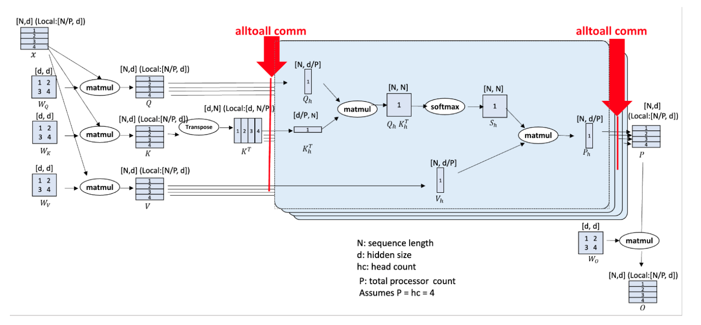

# NPU HunyuanVideo模型推理优化实践

本文主要介绍HunyuanVideo模型基于NPU的推理优化策略。

## NPU fa融合算子适配

使用torch_npu内置的Fused Infer Attention Score(FIA)融合算子替代FlashAttention算子，在`hyvideo/modules/attention.py`的attention函数中（L119），使能npu的FIA算子。当attention()的参数`mode=flash`时，启用FIA算子。具体设置可参考[Ascend社区文档](https://www.hiascend.com/document/detail/zh/Pytorch/710/apiref/torchnpuCustomsapi/context/torch_npu-npu_fused_infer_attention_score.md)。

此处将qkv按照序列长度拆分，分别计算图像部分的attention和文本部分的attention，最后进行拼接。

```python
    elif mode == "flash":
        scale = 1.0 / math.sqrt(d)
        if cu_seqlens_q is None:
            x = torch_npu.npu_fused_infer_attention_score(
                q, k, v,
                num_heads=n,
                input_layout="BNSD",
                scale=scale,
            )[0]
        else:
            attn1 = torch_npu.npu_fused_infer_attention_score(
                q[:, :, :cu_seqlens_q[1], :],
                k[:, :, :cu_seqlens_kv[1], :],
                v[:, :, :cu_seqlens_kv[1], :],
                num_heads=n,
                input_layout="BNSD",
                scale=scale,
            )[0]
            attn2 = torch_npu.npu_fused_infer_attention_score(
                q[:, :, cu_seqlens_q[1]:, :],
                k[:, :, cu_seqlens_kv[1]:, :],
                v[:, :, cu_seqlens_kv[1]:, :],
                num_heads=n,
                input_layout="BNSD",
                scale=scale,
            )[0]
            x = torch.cat([attn1, attn2], dim=2)
```

## 序列并行

假设input的shape为B，S，N，D，分别代表（batch size，sequence，number of head，dimension），序列并行即将input沿着S维度进行切分，在多卡上实现更低的动态显存占用，和更高的DiT性能。

### Ulysses Sequence Parallelism (SP)：

如图所示，首先将input沿着S维度切分为S/SP，其中SP为序列并行数量，输入模型，直到attn操作。在attn操作时，需要一次AllToAll通讯，交换每张卡存储的数据，等价为将input的shape从（B，S/SP，N，D）reshape为（B，S，N/SP，D）。即从切分序列长度改为切分head num。在attn结束后，由于每张卡实际仅计算1/SP的head的结果，所以需要再一次AllToAll通讯获得完整的attn结果。



### Ring Attention Sequence Parallelism (SP)：

如图所示，首先将input沿着S维度切分为S/SP，其中SP为序列并行数量，输入模型。当attn计算时，保持本卡的1/SP的Q不动，通过P2P(Peer-To-Peer)，将当前维护的1/SP的KV对传递给下一张卡。每张卡循环接收其他卡的KV对，与本卡的Q计算注意力。


图片来源：[feifeibear](https://github.com/feifeibear/long-context-attention)

## TeaCache

TeaCache是一种针对DiT的推理加速优化点，通过缓存相邻DiT step间输出的差值，复用此差值从而跳过当前DiT step，达到加速推理的结果。

首先选取Timestep Embedding Modulated Noisy Input的$\ell_1$距离反应当前timestep和上一步timestep的输出差异。

如果两者的输出差异大于一个阈值（即，累加的$\ell_1$距离>阈值），则代表当前timestep需要完整计算，将$\ell_1$距离清零；如果两者的输出差异小于一个阈值（即，累加的$\ell_1$距离<阈值），则代表当前timestep可以跳过，累加$\ell_1$距离。

除此之外，TeaCache提出了一个多项式scale机制，考虑到不同模型之间模型参数的均值和方差不同，相同input在不同的模型间，Timestep Embedding Modulated Noisy Input可能存在较大的差异，所以TeaCache将累加的$\ell_1$距离经过一个多项式函数放缩，此多项式函数的系数通过对模型随机采样获得。

```python
coefficients = [7.33226126e+02, -4.01131952e+02, 6.75869174e+01, -3.14987800e+00, 9.61237896e-02]
rescale_func = np.poly1d(coefficients)
self.accumulated_rel_l1_distance += rescale_func(
    ((modulated_inp - self.previous_modulated_input).abs().mean() /
    self.previous_modulated_input.abs().mean()).cpu().item()
)
if self.accumulated_rel_l1_distance < self.rel_l1_thresh:
    should_calc = False
else:
    should_calc = True
    self.accumulated_rel_l1_distance = 0
```