# NPU DeepSeek-V3.2-Exp推理优化实践

DeepSeek团队发布了最新的模型DeepSeek-V3.2-Exp，可利用稀疏架构 **DeepSeek Sparse Attention(DSA)** 来提高长序列的计算效率，降低推理成本。长上下文场景和其新颖的DSA结构，共同对推理优化系统提出了新诉求。

本文主要介绍基于A3集群的DeepSeek-V3.2-Exp模型的Prefill和Decode推理优化，首先分析了DeepSeek-V3.2-Exp模型的结构特点，实现了长序列亲和模型并行策略，并设计了新的NPU融合Kernel和多流并行优化。基于这些优化点，本实践0day实现了DeepSeek-V3.2-Exp BF16模型部署，1day实现W8A8C16模型部署，目前已支持C8量化，未来将持续完成低比特量化算法。4~8K常规序列继承原有DeepSeek-V3.1优化，16K~166K长序列推理场景结合DSA稀疏收益，性能超越DeepSeek-V3.1，模型和融合Kernel均已开源。

针对该模型涉及到的DSA结构中的**Lightning Indexer(LI)**和**Sparse Flash Attention(SFA)**新算子，本次开源不仅包含**AscendC**实现，并且首次公布了自研**PyPTO**实现，仅需几百行代码即可完成动态Shape算子编程。PyPTO是CANN 推出的大融合算子的编程体系，提供面向 MegaKernel 的编程范式。其核心思想是使用 Tensor/Tile 作为数据的基本表达方式，借助一系列对 Tensor 的基本运算来描述和组装完整的计算流程，采用human-in-the-loop和白盒化的方式能够充分利用SRAM的空间，实现对多核的高效利用。

同时，**TileLang**开源社区也已对接CANN软件栈，同步支持了DSA结构中的LI和SFA新算子。

## Highlights
- 整体部署策略沿用DeepSeek的大EP并行方案，针对稀疏DSA结构，叠加实现长序列亲和的CP并行策略，兼顾时延和吞吐。[模型推理代码](../../../models/deepseek-v3.2-exp/README.md)已开源，同时也适配了主流开源推理框架vLLM和SGLang
- 基于AscendC实现NPU LI和SFA融合Kernel，包含Lightning Indexer和Sparse Flash Attention，发挥稀疏计算潜力，AscendC Kernel[技术文档](./deepseek_v3.2_exp_ascendc_operator_guide.md)和[代码](../../../ops/ascendc/README.md)已开源
- 基于自研PyPTO框架实现NPU DSA，提高融合算子编程易用性。不仅实现了LI融合Kernel，同时实现了更大范围的Decode Attention融合，PyPTO Kernel[技术文档](./deepseek_v3.2_exp_pypto_operator_guide.md)和[代码](../../../ops/pypto/README.md)已开源
- 开源社区TileLang同步支持DSA结构中的LI和SFA算子，TileLang Kernel[技术文档](./deepseek_v3.2_exp_tilelang_operator_guide.md)和[代码](../../../ops/tilelang/README.md)已开源
- 基于上述优化点，CANN已0day支持DeepSeek-V3.2-Exp BF16推理部署，1day支持Int8量化。Prefill和Decode的参考性能：采用BF16精度无损方式，64卡128K长序列TTFT小于2s（无缓存命中），TPOT小于30ms；W8A8C8量化场景64卡128K长序列TPOT小于20ms

## Outline

- [DeepSeek-V3.2-Exp vs V3.1](##DeepSeek-V3.2-Exp-vs-V3.1)
- [并行策略](##并行策略)
- [MTP](##MTP)
- [融合Kernel](##融合Kernel)
- [量化策略](#量化策略)
- [多流并行优化](##多流并行优化)
- [KVCache Offload](##KVCache-Offload)
- [Benchmark](##Benchmark)
- [Future Plan](##Future-Plan)

## DeepSeek-V3.2-Exp vs V3.1

相较DeepSeek-V3.1，DeepSeek-V3.2-Exp主要新增了**Lightning Indexer**稀疏模块，旨在从长序列中稀疏选择Topk个Token用于计算注意力。

- 权重内存分析

  Lightning Indexer是一个轻量的类MQA结构，新增了**q_b proj**，**wk proj**和**weight proj**三个Linear层，其权重大小分别为：
  $$
  \begin{aligned}
  \mathrm{Param}_{\mathrm{q\_b\_proj}}&=\mathrm{q\_lora\_rank}  \times \mathrm{Indexer\_head\_num} \times \mathrm{Indexer\_head\_dim} \\
  \mathrm{Param}_{\mathrm{wk\_proj}} &= \mathrm{hidden\_size} \times \mathrm{Indexer\_head\_dim}\\
  \mathrm{Param}_{\mathrm{weight\_proj}} &= \mathrm{hidden\_size} \times \mathrm{Indexer\_head\_num}
  \end{aligned}
  $$
  综合所有Layer，权重参数量新增**0.85B**左右。

- KVCache内存分析

  为了保障模型效果，DeepSeek-V3.2-Exp仍然缓存了完整MLA的Full KVCache。与此同时，为了提高推理效率，避免decode阶段重复计算Indexer Key，需要**新增缓存Indexer Key Cache**，其内存大小为：
  $$
  \mathrm{batch\_size}\times \mathrm{kv\_length} \times \mathrm{Indexer\_head\_dim} \times \mathrm{storage\_bytes} \times \mathrm{num\_layers}
  $$
  以每个rank处理4batch 64K序列长度为例，BF16场景新增的Indexer Key Cache约为**4GB**左右。

- MLA Naive vs Absorb

  在Prefill阶段，以1batch 64K推理为例，Lightning Indexer为每个q token选择TopK=2048个kv token，MLA的计算流程可以有三种选择：

  **方案一：** MLA Naive + Sparse Mask，Prefill MLA使用Naive模式，和原始DeepSeek V3保持一致。每个q token和所有的历史kv token计算Attention，仅在softmax前通过Attention Mask将不属于TopK的token过滤掉。Attention中的两个BatchMatmul Shape如下：

  |   方案一    | Batch |  M   |  K   |  N   |
  | :---------: | :---: | :--: | :--: | :--: |
  | BMM1(Q*K^T) | 1*128 | 64K  | 192  | 64K  |
  |  BMM2(P*V)  | 1*128 | 64K  | 64K  | 128  |

  该方案计算量和原始的Full Attention一致，但是无法拿到DSA的稀疏计算收益，长序列场景下性能不佳。

  **方案二：** MLA Naive + Sparse Attention，Prefill MLA使用Naive模式，每个q token与TopK=2048个kv token计算Attention。

  |   方案二    |   Batch    |  M   |  K   |  N   |
  | :---------: | :--------: | :--: | :--: | :--: |
  | BMM1(Q*K^T) | 1\*64K*128 |  1   | 192  | 2048 |
  |  BMM2(P*V)  | 1\*64K*128 |  1   | 2048 | 128  |

  方案二的优点在于BMM的计算量较小，相对原始的Full Attention计算量减小了64K/2048=32倍，但是存在以下问题：

  - BMM的M轴为1，矩阵乘法计算效率较低
  - BMM的HBM访存量相较原始的Full Attention激增2048倍，将会面临访存瓶颈

  **方案三：** MLA Absorb + Sparse Attention，Prefill MLA使用Absorb模式，与Decode保持一致。同样地，每个q token与TopK=2048个kv token计算Attention。

  |   方案三    | Batch  |  M   |  K   |  N   |
  | :---------: | :----: | :--: | :--: | :--: |
  | BMM1(Q*K^T) | 1\*64K | 128  | 576  | 2048 |
  |  BMM2(P*V)  | 1\*64K | 128  | 2048 | 512  |

  方案三与方案二对比如下：

  - 方案三的计算量增加了3倍左右，但其BMM的M轴为128，对于矩阵乘法更为友好

  - 方案三的HBM访存量相对方案二降低几十倍，访存耗时更低


综合考虑计算和访存耗时，以及长序列应用场景，本实践选择基于方案三(MLA Absorb + Sparse Attention)来完成Prefill部署，从而Prefill和Decode的MLA计算流可以归一。

为了更优的推理时延和吞吐，针对长序列+DeepSeek-V3.2-Exp模型，本实践设计了NPU亲和的并行策略，并实现了NPU Lightning Indexer(LI)和Sparse Flash Attention(SFA)融合kernel，细节参考后续章节。

## 并行策略

Atlas A3推荐部署策略如下图所示，Prefill使用M个节点部署，Decode使用N个节点部署，每个节点包含8卡。其中BF16场景下，推荐根据资源数量、SLA等约束，M在4~8，N在4~16内动态调整。

<p align="center">
  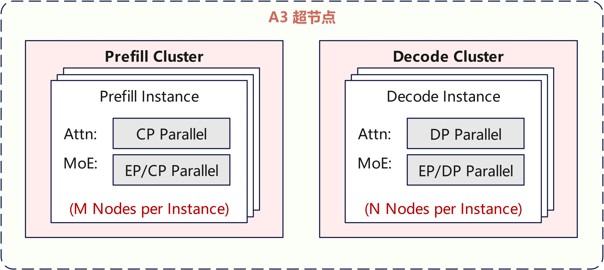
</p>


### Prefill并行策略

DeepSeek-V3.2-Exp新增的DSA主要面向**长序列推理**场景，Prefill阶段设备内存OOM风险较高，而且推理服务部署时TTFT也会面临巨大的挑战，因此优化内存占用和TTFT是并行策略设计的主要目的。

如果沿用DeepSeek R1 Blog里的Attention DP策略，每个rank都需要推理不同的超长序列，总计算量较大，TTFT较高，用户体验较差。

Tensor Parallel(TP)是优化推理TTFT的重要手段，但DeepSeek-V3.2-Exp中DSA新增的Indexer模块计算量和$S^2$成正比，是长序列场景下的主要瓶颈，该模块针对head轴做了Reduce Sum操作，TP切分会产生大量的通信开销，影响整网性能。

综合上述两点，**DeepSeek-V3.2-Exp模型Prefill Attention选用Context Parallel(CP)并行**，多个rank均摊长序列的计算，单rank的计算量和activation内存都较小，TTFT较为可控，用户体验更好。MoE模块则沿用DeepSeek-V3.1的EP并行，兼顾吞吐与时延。

Prefill的并行策略可以设计为下图形式：

<p align="center">
  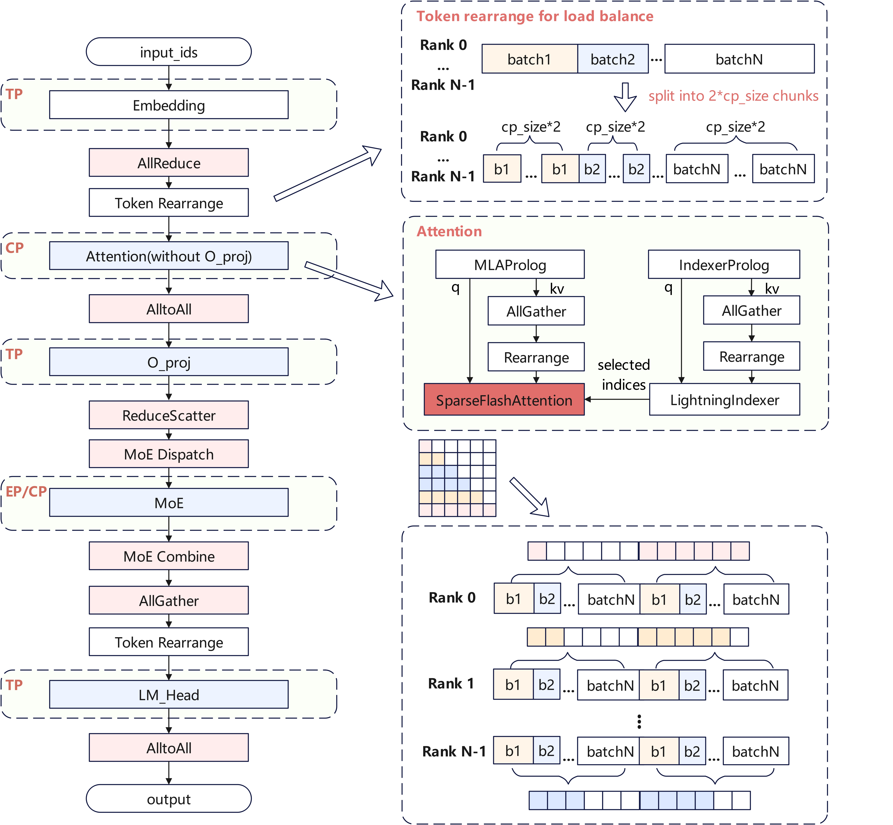
</p>


- Embedding并行策略

  为了节省Embedding Table的内存占用，Embedding计算使用TP并行，tp_size控制在单Node内，之后通过AllReduce聚合。

- Attention并行策略

  Attention整体选用CP并行，以64K输入推理为例，每个rank处理64K/cp_size=1K个token，在计算完kv之后，对所有CP域的kv token进行AllGather，得到完整的kv结果。每个rank拿到64K/cp_size的q token和完整的kv token，进行后续的Attention计算。

  Attention计算需要遵循因果注意力，如果CP简单按照rank顺序进行切片可能会面临计算负载均衡问题。如第一个rank关注到的历史kv token很少，计算量较小；最后一个rank关注到的历史kv token较多，计算量较大。为了降低负载不均带来的影响，需要将输入的input_ids按照cp_size*2进行切片，如上图右侧所示，每个rank负责计算头尾对称的两个切片，每层Lightning Indexer和Sparse Flash Attention计算前通过Token重排将kv还原回因果顺序。

  考虑到O_proj模块内存占用较大，本实践选择对其局部进行TP切分，因此O_proj前后引入AlltoAll和ReduceScatter算子。

- MoE并行策略

  MoE模块沿用了和DeepSeekV3相同的EP并行部署，EP复用CP通信域。

- LM Head并行策略

  为了节省LM Head的内存占用，LM Head选用TP切分，tp_size控制在单Node内。

  LM_Head模块采用TP切分，同样需要在TP域内做AllGather，但此处为整个CP域内的AllGather，并通过Token重排将最终输入LM_Head的feature map还原到原始序列排布。

### Decode并行策略
Decode阶段依旧沿用DeepSeek-V3.1的部署策略，选用Attention DP + MoE EP部署。

特别地，由于O_proj和LM_Head权重内存较大，且在Decode阶段表现为明显的访存瓶颈，本实践选用局部TP并行。同时为了降低设备内存占用，Embedding层同样使用TP切分。为了尽可能地减小TP并行带来的通信开销，TP域控制在高速互联HCCS域内。

<p align="center">
  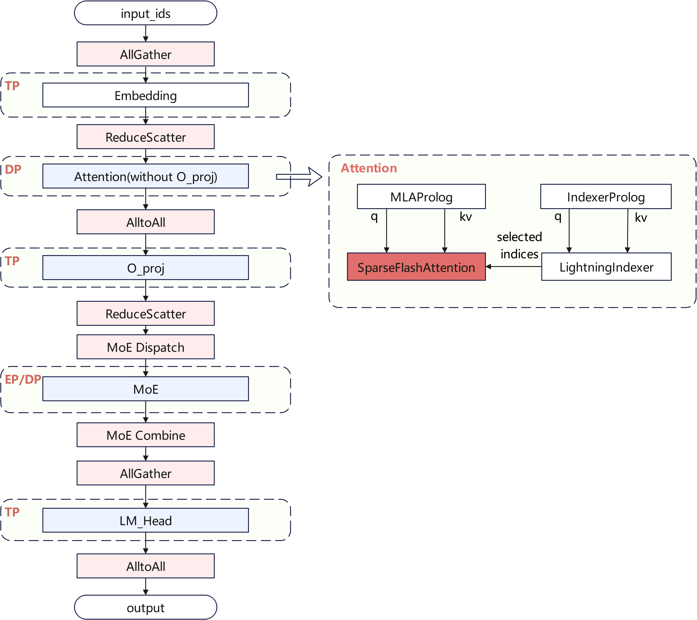
</p>

## MTP

DeepSeek-V3.2-Exp依然提供了原生的Multi-Token Prediction(MTP)机制，MTP机制允许在一次主模型推理过程中同时推理多个Token，在相似的数据搬运下，进行更多的计算，以充分利用芯片的算力，提升模型等效时延和吞吐。

DeepSeek-V3.2-Exp由于采用了新的DSA结构，MTP加速相对于DeepSeek-V3.1会更复杂。Full Attention场景的MLA无论是否使用MTP，其KV Cache的搬运量相同。因此MTP能够提高计算访存比，从而提高算力利用率，CANN中MLA算子在MTP1场景的算力利用比可以达到70%以上。而对于DeepSeek-V3.2-Exp采用的Sparse Flash Attention，每个q token都会选择2048个激活的kv token，极端情况下MTP1场景需要搬运的KV Cache是非MTP场景的两倍，反而增加了离散访存的代价。

<div style="text-align: center;">


**64k序列长度 4batch的搬运量和计算量**

<table style="width:99%; border-collapse:collapse; margin:20px 0;">
    <tr>
        <th style="border:1px solid #ddd; padding:10px; text-align:center;"> </th>
        <th style="border:1px solid #ddd; padding:10px; text-align:center;"> </th>
        <th style="border:1px solid #ddd; padding:10px; text-align:center;">KV搬运量（MB）</th>
        <th style="border:1px solid #ddd; padding:10px; text-align:center;">Cube计算量（GFlops）</th>
        <th style="border:1px solid #ddd; padding:10px; text-align:center;">QK^T搬运量（MB）</th>
    </tr>
    <tr>
        <td rowspan="2" style="border:1px solid #ddd; padding:10px; text-align:center;">MLA</td>
        <td style="border:1px solid #ddd; padding:10px; text-align:center;">非MTP</td>
        <td style="border:1px solid #ddd; padding:10px; text-align:center;">144</td>
        <td style="border:1px solid #ddd; padding:10px; text-align:center;">19.33</td>
        <td style="border:1px solid #ddd; padding:10px; text-align:center;">32</td>
    </tr>
    <tr>
        <td style="border:1px solid #ddd; padding:10px; text-align:center;">MTP1</td>
        <td style="border:1px solid #ddd; padding:10px; text-align:center;">144</td>
        <td style="border:1px solid #ddd; padding:10px; text-align:center;">38.65</td>
        <td style="border:1px solid #ddd; padding:10px; text-align:center;">64</td>
    </tr>
    <tr>
        <td rowspan="2" style="border:1px solid #ddd; padding:10px; text-align:center;">SFA</td>
        <td style="border:1px solid #ddd; padding:10px; text-align:center;">非MTP</td>
        <td style="border:1px solid #ddd; padding:10px; text-align:center;">4.5</td>
        <td style="border:1px solid #ddd; padding:10px; text-align:center;">0.60</td>
        <td style="border:1px solid #ddd; padding:10px; text-align:center;">1</td>
    </tr>
    <tr>
        <td style="border:1px solid #ddd; padding:10px; text-align:center;">MTP1</td>
        <td style="border:1px solid #ddd; padding:10px; text-align:center;">9</td>
        <td style="border:1px solid #ddd; padding:10px; text-align:center;">1.21</td>
        <td style="border:1px solid #ddd; padding:10px; text-align:center;">2</td>
    </tr>
    <tr>
        <td rowspan="2" style="border:1px solid #ddd; padding:10px; text-align:center;">LI</td>
        <td style="border:1px solid #ddd; padding:10px; text-align:center;">非MTP</td>
        <td style="border:1px solid #ddd; padding:10px; text-align:center;">32</td>
        <td style="border:1px solid #ddd; padding:10px; text-align:center;">2.15</td>
        <td style="border:1px solid #ddd; padding:10px; text-align:center;">16</td>
    </tr>
    <tr>
        <td style="border:1px solid #ddd; padding:10px; text-align:center;">MTP1</td>
        <td style="border:1px solid #ddd; padding:10px; text-align:center;">32</td>
        <td style="border:1px solid #ddd; padding:10px; text-align:center;">4.29</td>
        <td style="border:1px solid #ddd; padding:10px; text-align:center;">32</td>
    </tr>
</table>

</div>

尽管Sparse Flash Attention很难利用MTP实现可观的加速效果，但是Lightning Indexer算子在长序列场景中耗时占比更高，其K Cache搬运与稠密MLA相似，可以利用MTP机制提高计算访存比。另一方面，由于DSA稀疏计算显著降低了长序列的计算量，削弱了Attention在整个推理的占比，而剩下的算子（如Matmul等）都能达到更好的计算访存比，因此使用MTP对整个推理有比较可观的加速。


## 融合Kernel

DSA的计算过程可分为MLAProlog、IndexerProlog、Lightning Indexer、Sparse Flash Attention、MLAEpilog五部分，如下图所示：

<p align="center">
  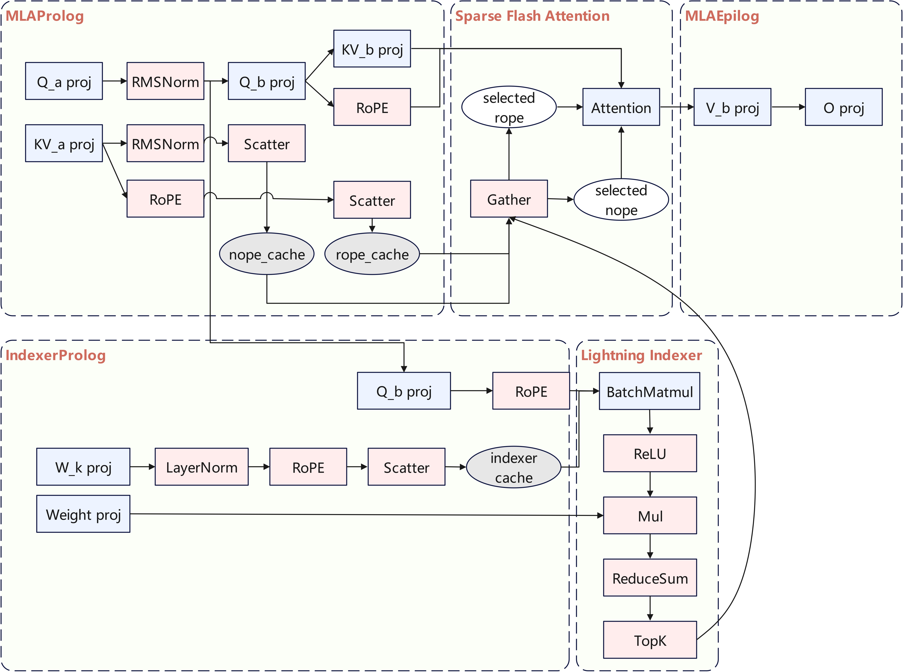
</p>


- Lightning Indexer：包含Score Batchmatmul、ReLU、ReduceSum、TopK等操作，长序列场景TopK操作会成为瓶颈，可用TopK计算耗时流水掩盖掉其他操作的耗时，从而拿到计算流水收益
- Sparse Flash Attention：包含了从完整KVCache里选取TopK相关Token，及计算稀疏Flash Attention操作。此处的耗时瓶颈点主要在于离散聚合访存，可用此耗时掩盖其他操作的耗时，流水并行加速
- MLAProlog和IndexerProlog：包含Q/KV的LoRA、RoPE、Norm、KVCache更新等操作，存在较多Cube/Vector并行的流水空间
- MLAEpilog：包含O_proj及V升维操作

目前NPU已实现并开源**Lightning Indexer和Sparse Flash Attention**，使用方式参见[融合Kernel执行指导](../../../ops/ascendc/README.md)


## 量化策略

相对于BF16推理，Int8量化可以有效降低端到端时延，提升系统吞吐。目前本实践已经支持W8A8C8/W4A8C8量化，量化架构如下：

<p align="center">
  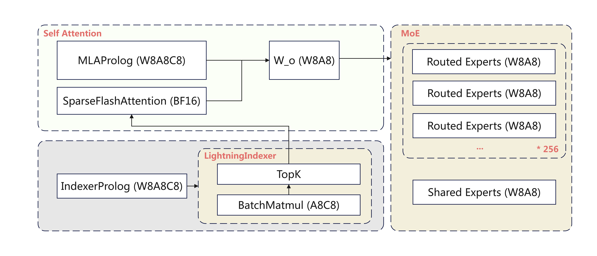
</p>

其中MLAProlog、MLAEpilog、IndexerProlog、LightningIndexer三个量化融合算子如下：

<p align="center">
  
</p>

- MLAProlog：除Q_b_proj使用W8A8，其他Linear均不量化；KVCache量化到C8；
- Sparse Flash Attention：KVCache Int8存储，BF16计算；
- IndexerProlog：除Q_b_proj使用W8A8，其他Linear均不量化；Indexer Q使用A8量化；Indexer Cache使用C8量化；
- Lightning Indexer: BatchMatmtul使用Int8计算；
- MoE：路由专家使用W8A8/W4A8量化，共享专家使用W8A8量化；
- MLAEpilog：O_proj使用W8A8量化；
- LM_Head：暂不量化。

**注：
W8A8：W8指权重使用静态Per-Channel Int8量化，A8指数据使用动态Per-Token Int8量化；
A8C8：A8表示Lightning Indexer中的Q使用动态Per-Token-Head Int8量化，Indexer Cache使用动态Per-Token-Head Int8量化；
MLAEpilog：O_proj使用W8A8量化；
KVCache C8：表示KVCache 使用动态Per-Token-Head-Tile-128 Int8量化；**


W8A8C8对线性层量化数量较少，MLA线性层只量化了`q_b_proj`和`w_o_proj`，Indexer线性层只量化`wq_b_proj`。主要原因是IndexerProlog融合算子设计成`weights_proj`出fp16，且不做量化，因此MLA输入关联的Linear统一不做量化，好处是可将同一份BF16数据输入IndexerProlog和MLAProlog。

其次，MLAProlog KVCache的量化策略使用了动态存8算16。在超长序列情况下，W8A8C8量化精度接近无损，同时权重内存占用优化2倍。MLA C8算16获取内存收益，可以打高吞吐量。另一方面，LightningIndexer的A8C8获取计算收益，降低LI计算时延，TTFT和TPOT也同步优化。

W4A8C8量化版本针对`DeepSeek-V3.2-Exp`使用基于学习的量化算法优化Clamp参数，缓解W4A8离群值量化困难的问题，实现了较优的量化模型精度。同时，W4A8C8版本比W8A8C8节约MoE权重显存2x，因此在大EP场景下，利用W4A8 MoEGMM算子，同一张卡可以装下更多的专家，节约资源，优化计算访存比，实现单机部署。


**量化模型精度表现**

| 模型 | MMLU | GPQA | DROP | MGSM |
| ---- | ---- | ---- | ---- | ---- |
| DeepSeek-V3.2-BF16 | 90.8 | 75.85 | 87.57 | 90.9 |
| DeepSeek-V3.2-Exp-W8A8C8 | 90.62 | 75.90 | 87.41 | 90.87 |
| DeepSeek-V3.2-Exp-W4A8C8 | 90.66 | 76.5 | 87.68 | 91.3 |

## 多流并行优化

CANN提供了[多流并行](https://gitcode.com/Ascend/torchair/blob/master/feature/多流并发.md)的机制，可支持计算/通信并行等。由于A3芯片为CV分离架构，也可支持Cube/Vector并行。

针对MoE模型，可利用CANN的多流并行能力，提高芯片资源利用率。MoE模块中，路由专家采用EP部署，共享专家采用DP部署。共享专家的计算与路由专家的Gating、Dispatch、计算没有依赖关系，可以通过多流并行机制来使二者流水掩盖。由于Gating函数的权重较小，且Dispatch算子为通信算子，二者的HBM带宽占用率比较低，可以与共享专家（带宽瓶颈）进行并发，掩盖掉共享专家的耗时。

<p align="center">
  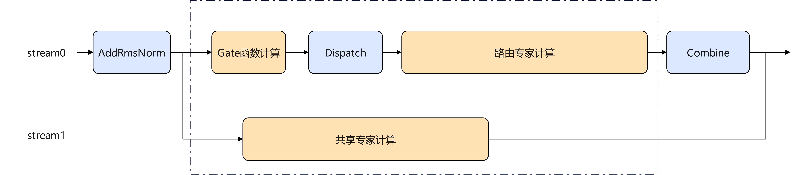
</p>


简单代码示例如下：

```python
with torchair.scope.npu_stream_switch(stream_tag, stream_priority):
	# shared_expert use another stream
    hidden_states_share = self.shared_experts(hidden_states)
# router_experts use main stream
hidden_states_router = self.router_experts(hidden_states)
hidden_states = hidden_states_share + hidden_states_router
```

除了MoE模块，Lightning Indexer前的一系列Cube和Vector算子（IndexerProlog）也可使用多流并行，流水示意图如下：

<p align="center">
  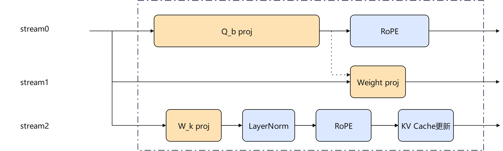
</p>


## KVCache Offload
使能W8A8C8量化后，由于受限于设备内存，在长序列场景 batch size依然无法进一步提升。为了解决设备内存紧张问题，可将占比较高的MLA Full KVCache内存卸载到Host内存上，完成KVCache的Offload，释放设备内存压力，达到提高batch size的目的。 KVCache Offload方案涉及Prefill阶段和Decode阶段。
### Prefill Stage
Prefill阶段，在设备上只**申请一层MLA KVCache**，同时每卡在Host内存上申请61层KVCache内存。MLA计算完后，通过多流的方式将当前层设备上的KVCache卸载到Host侧的内存上。
<p align="center">
  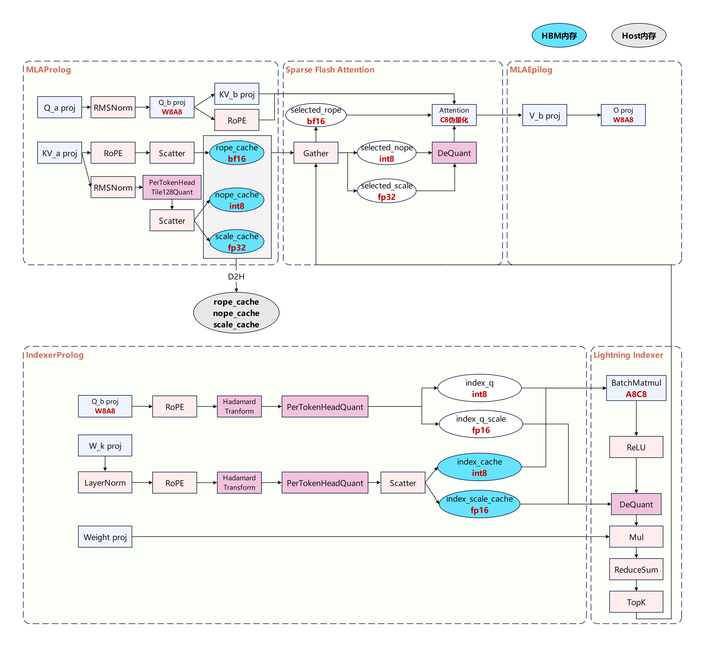
</p>

### Decode Stage
Decode阶段，每一层计算得到的当前Token的Cache更新到Host内存上，新增的[GatherSelectionKvCache](../../../ops/ascendc/docs/custom-npu_gather_selection_kv_cache.md)算子，根据Lightning Indexer模块返回的TopK个相关Token的位置信息，从Host侧的Full KVCache选出对应的需要参与计算的kv token，送给后续的SFA计算。
<p align="center">
  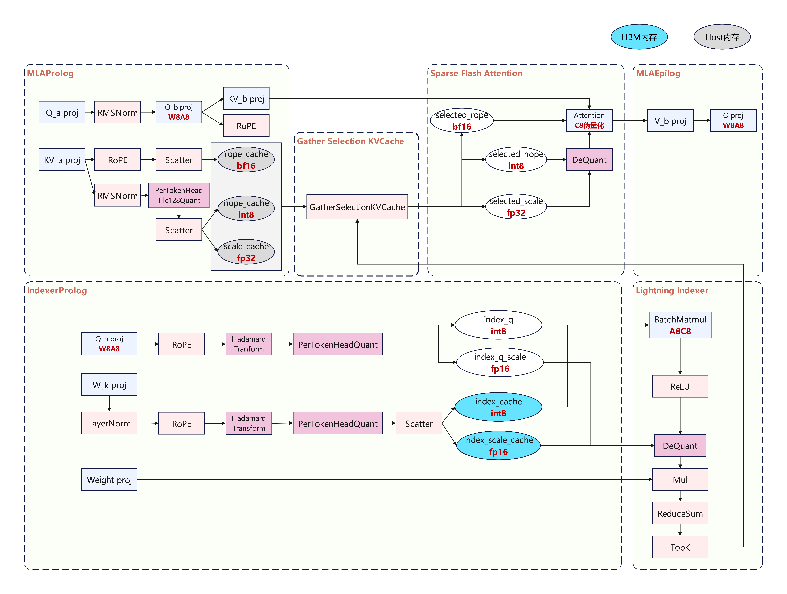
</p>

其中 GatherSelectionKvCache 算子充分利用了前后Token在同一层上TopK 命中率（相似度）特性，将已经在设备上的Cache做了复用。也即如果当前步的TopK=2048个kv token和前一步的TopK=2048个kv token有60%一样，那只需要从Host侧读取40%的没有复用的kv token，60%可以复用的kv token直接从设备上读取，从而减少了H2D的耗时。


## Benchmark

#### W8A8C8

基于 Atlas A3，本实践对 DeepSeek-V3.2-Exp 与 DeepSeek-V3.1 W8A8C8 版本进行了性能Benchmark 测试。从吞吐对比曲线可见，随着序列长度增加，DeepSeek-V3.2-Exp 的性能优势逐步扩大，当序列长度达到 128K 时，其吞吐达到 DeepSeek-V3.1 的 450%。

<p align="center">
  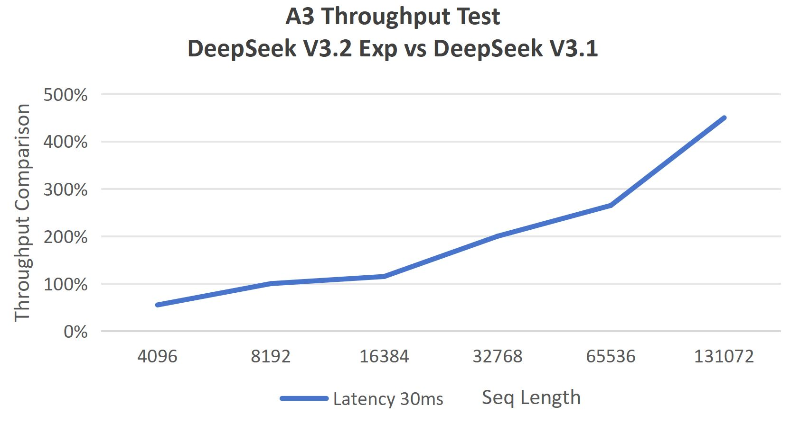
</p>

下表展示了未启用 Offload 时，不同 batch size 和序列长度下的推理时延和吞吐值。

| Global Batch Size | Seq Length | Chips | TPOT (ms) | Throughput (tokens/p/s) |
| ----------------- | ---------- | ----- | --------- | ----------------------- |
| 256               | 65536      | 64    | 19.84     | 202                     |
| 512               | 65536      | 64    | 22.78     | 351                     |
| 128               | 131072     | 64    | 18.85     | 106                     |
| 512               | 131072     | 64    | 25.8      | 310                     |

> 注：性能数据基于 MTP3 与 perfect eplb 配置采集，平均 3 个 draft token 中 accept token 为 1.44 个。

#### MoE W4A8 + Attention W8A8C8

本实践新增了MoE部分W4A8量化的支持，针对权重较大存在搬运bound的场景，W4A8能够有效减少内存占用并降低权重搬运耗时，从而显著提升推理性能。基于Atlas A3环境，本实践对MoE W4A8量化特性进行了Benchmark测试。相同集群规模和配置下，相比W8A8量化，模型推理性能得到了一定的提升，且单芯片上的权重越大，性能提升效果越明显。

| MoE Quant Mode | Global Batch Size | Chips | TPOT (ms) | Throughput (tokens/p/s) |
| -------------- | ----------------- | ----- | --------- | ----------------------- |
| W8A8           | 64                | 32    | 20.81     | 96                      |
| W4A8           | 64                | 32    | 20.18     | 99                      |
| W8A8           | 32                | 16    | 24.39     | 82                      |
| W4A8           | 32                | 16    | 22.51     | 89                      |

> 注：性能数据基于相同输入序列长度65536，MTP及其他配置同上。

#### KVCache Offload

基于 Atlas A3 环境，在 DeepSeek-V3.2-Exp 模型使能 W8A8C8 量化的基础上，对 KVCache Offload 特性进行了 Benchmark 测试。同等序列长度下，通过使能 KVCache Offload 技术方案，相比非 Offload，模型推理支持的最大 batch size 可以翻倍。下图展示了 Offload 的内存收益，固定序列长度为 64K，相比非 Offload，在使用 Offload 时 global batch size 可从 1024 增长到 2048；固定 global batch size 为 128，使用 Offload 时序列长度可从 256K 增长到 384K。

<p align="center">
  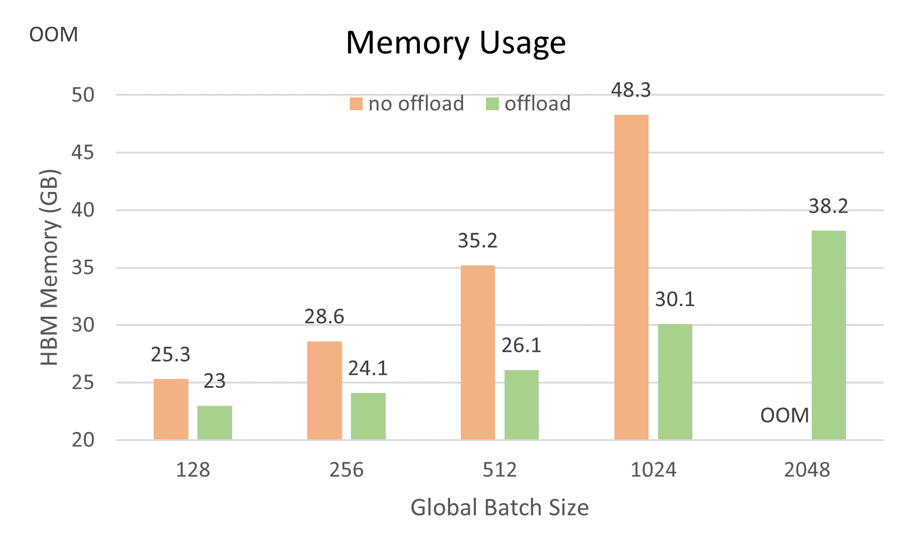
  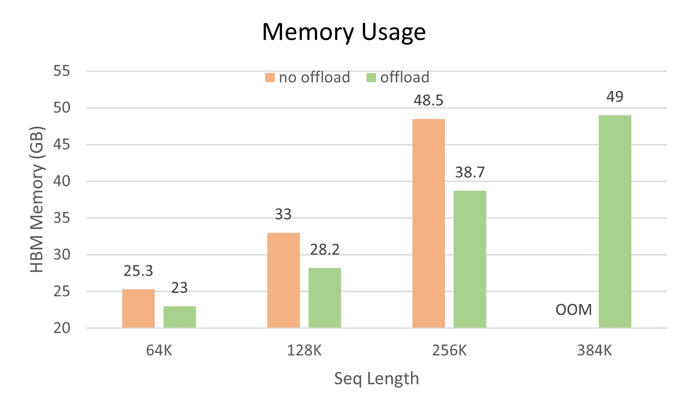
</p>

> 注：内存数据基于 MTP3 与 perfect eplb 配置采集。

## Future Plan

- 量化：目前支持BF16/Int8版本推理。未来进一步开发低比特量化版本，探索KVCache量化压缩算法，软硬协同优化NPU计算效率，降低系统时延
- KVCache Offload：利用前后Token命中率关系或跨layer预取等手段，进一步降低GatherSelectionKvCache耗时
- MegaKernel：Decode阶段仍然存在较多流水并行空间，可通过PyPTO实现更大范围的MegaKernel，完成多核MPMD并行调度，提升计算效率

