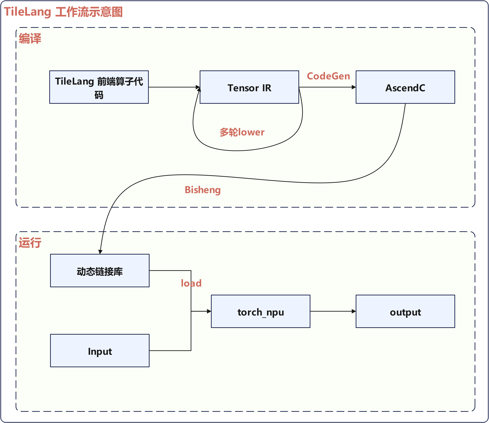
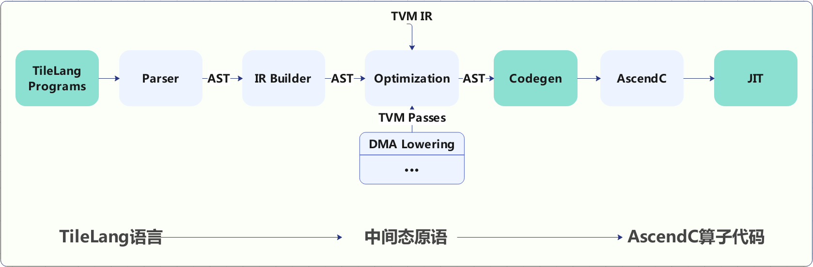
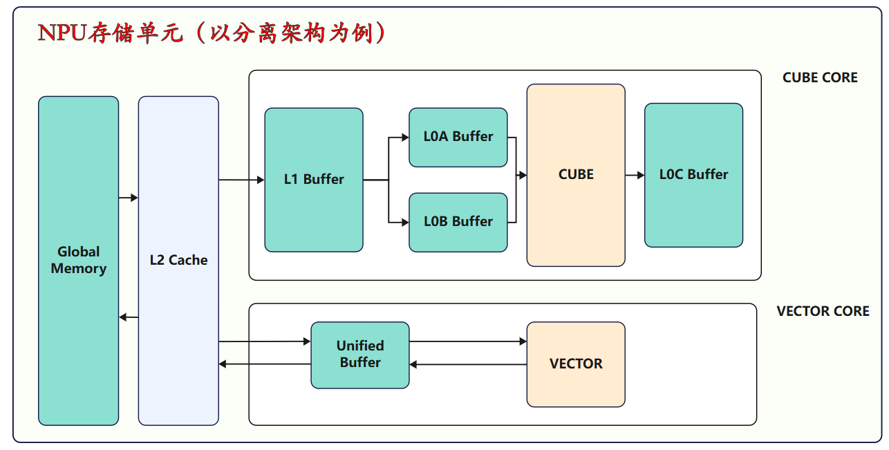
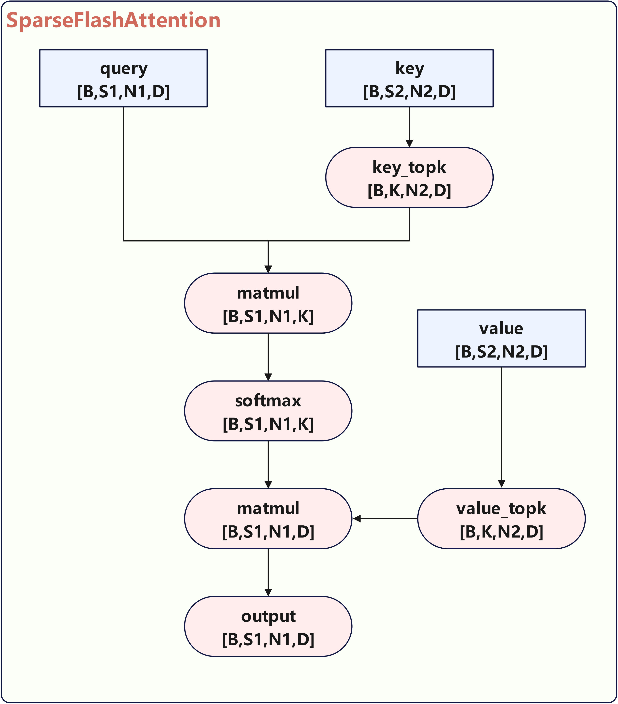
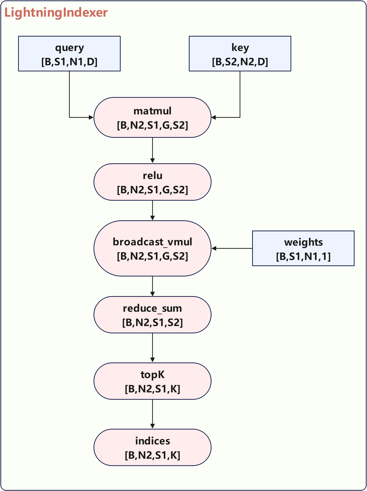

# NPU DeepSeek-V3.2-Exp TileLang算子开发实践

## 简介

近年来AI大模型出现爆炸式增长，其对高性能算子的要求也越来越高。但开发高性能的算子并非易事，传统 AI 编程涉及复杂的调度优化（如线程绑定、布局优化、张量化等），需要大量手动编写调度代码，导致开发效率低且难以维护。在这种背景下，专门针对AI领域的DSL应运而生。尽管最近针对AI工作负载的DSL极大的简化了高性能算子内核的创建，即使数据流被明确暴露，但它们仍然将大多数低级优化与算子内核紧密交织在一起。例如Triton虽然提供了直观的块级原语，但将线程行为、内存布局和地址空间注释隐藏在自动生成的策略背后。这种抽象简化了编程，但却阻碍了那些寻求提取最大性能的经验丰富的开发者。

为了克服目前DSL的这些不足，TileAI开源社区提出了TileLang算子编程语言，旨在简化高性能GPU/NPU/CPU算子（例如GEMM、Dequant GEMM、FlashAttention、LinearAttention）的开发。TileLang采用类Python的语法，并在TVM之上构建底层编译器基础架构，能自动生成针对特定硬件优化的代码，使开发者专注于提高生产力，而无需牺牲实现最佳性能所需的底层优化。TileLang的核心设计理念是将调度空间（线程绑定、布局、张量化和流水线）与数据流解耦，并将其封装为一组可自定义的注解和原语，这使得用户专注于内核的数据流本身，而将大多数其他优化工作交由编译器完成。

本文主要介绍Ascend NPU适配TileLang的过程，以及基于其开发高性能算子的实践。

## Highlights

- 简化NPU算子编程复杂度：Tilelang采用类Python语法，大大降低NPU算子开发门槛，封装调度空间为自定义原语，开发者更加关注数据流本身。

- 支持灵活扩展：实现调度空间与数据流解耦，NPU算子优化由编译器自动完成，同时充分利用NPU底层硬件特性。

- 高性能：Tilelang可以实现高性能NPU算子，允许用户感知NPU硬件特性，相较Triton理论上可以获得更好的性能。
## TileLang NPU工作流程

下图展示了TileLang 在NPU上的工作流程，主要分为编译和运行两个阶段：


<p align="center">
  
  <center>TileLang 工作流示意图</center>
</p>


- 编译阶段

  1.  多级Lowering转换：TileLang算子根据NPU硬件特性进行多级降级，生成针对昇腾硬件优化的TensorIR表示
  2.  AscendC代码生成：基于TensorIR，使用专门的Ascend Codegen模块生成对应的AscendC代码
  3.  动态库编译：通过毕昇编译器（bisheng）将AscendC代码编译成动态链接库（.so文件）

- 运行阶段

  4.  库文件加载：通过torch_npu运行时库将.so文件加载到Python环境中
  5.  函数封装：将算子封装为可调用的Python函数对象
  6.  执行调用：用户以普通Python函数方式调用，提供输入张量即可在昇腾NPU上执行计算并获得结果


## TileLang NPU适配

下图是TileLang的整体编译运行流程图以及本次适配要修改的部分（深绿色显示）：


<p align="center">
  
  <center>TileLang 编译运行流程图</center>
</p>


### TileLang API

算子语言原语是支撑算子开发与执行的基础操作单元，其贯穿算子运行的完整生命周期。Tilelang API原语封装了昇腾AscendC后端接口，在此基础上提供精简高效的原语指令供用户使用，各原语通过功能协同，实现算子对硬件资源的高效调度与数据处理逻辑的可靠运行。原语的核心作用如下：
- NPU硬件能力精准适配。TileLang原语可封装NPU的底层硬件细节，实现算子与NPU架构的高效协同，屏蔽底层差异，降低开发复杂度。
- 算子开发效率提升。Tilelang API原语简化了NPU算子开发流程，降低技术门槛。封装好的Tilelang指令允许开发者快速构建NPU算子框架，用高效的Python语法实现AI Core级功能调用，标准化的接口也提升了代码复用性，便于实现更丰富、复杂的计算逻辑。
- 算子性能优化与可靠性保障。Tilelang API原语封装了AscendC算子后端语言，具有自动流水调度、内存存储访问模式优化等功能，能够提升NPU缓存命中率并降低计算资源占用与数据搬运量，并能够规避底层语言造成的数据残留、内存越界等问题。

下面为NPU存储结构图，展示NPU多级内存架构，方便用户理解相应内存分配与拷贝语义。
<p align="center">
  
  <center>NPU存储结构图</center>
</p>

针对昇腾后端实现如下几类原语，原语类型及典型原语介绍如下表：


| 原语类型     | 原语名称                                                     | 用法示例                                         | 功能介绍                                                     |
| ------------ | ------------------------------------------------------------ | ------------------------------------------------ | ------------------------------------------------------------ |
| 内核原语     | kernel                                                       | T.kernel(block\_num, is\_npu=True) as (cid, vid) | 该原语对应到AscendC的kernel调用处，其中block\_num对应于<<< >>>中的第一个参数，表示这个kernel开启多少个子任务数量。cid的范围为 $[0, block\\\_num)$, vid的范围为0或1。因为A2的cv核默认配比为1:2, 可以通过vid指定当前vector的索引。 |
| 内存分配原语 | alloc\_L1/L0A/L0B/L0C/UB                                     | T.alloc\_L1/L0A/L0B/L0C/UB(shape, dtype)         | 用于分配位于片上内存的buffer；通过指定shape和数据类型标记buffer的信息。 |
| 数据搬运原语 | copy                                                         | T.copy(src, dst)                                 | 将src上的buffer拷贝到dst上，注意buffer可以通过BufferLoad或者BufferRegion指定一小块区域。 |
| 计算原语     | gemm, add, mul, reduce\_max...                               | T.reduce\_max(dst, src, tmp, dim)                | 其中dim指定为对应规约的维度，目前只支持二维的规约。          |
| 同步原语     | set\_flag, wait\_flag, set\_cross\_flag, wait\_cross\_flag, pipe\_barrier | T.set\_cross\_flag(pipe: str, eventId: int)      | 其中pipe为需要同步的流水线，eventId为同步事件编号。          |


### CodeGen

在TileLang面向Ascend NPU的算子开发流程中，CodeGen（代码生成）模块是实现 “前端简洁开发” 与 “后端高效执行” 衔接的关键组件，其核心作用是通过指令模板封装与指令映射两大机制，将TileLang API高层抽象语法自动转化为标准AscendC语言，为后端算子开发提供标准化、规范化与高效化支撑。
- 语法转化与硬件适配。CodeGen通过预定义的AscendC指令模板，封装NPU底层硬件操作（如AI Core计算指令、DMAC数据传输指令）的语法细节与参数约束，CodeGen可自动解析TileLang语法树，根据语义逻辑匹配对应的指令模板，并通过指令映射规则，实现TileLang与AscendC NPU后端的无缝适配。
- 标准化与高效率算子代码生成。CodeGen将TileLang到AscendC的转化过程自动化，大幅缩短后端算子的开发周期；且CodeGen的指令模板经过AscendC NPU性能优化，生成的AscendC代码可直接调用NPU的硬件加速能力，有效降低人工编码可能导致的性能损耗。同时CodeGen生成的代码高度标准化，大幅提升后端算子代码的可维护性与跨版本兼容性。

#### Codegen适配
- 指令模板封装

  基于AscendC的基础/高阶API封装出相应的指令模板，例如 copy_gm_to_l1函数即表示将global memory上的一个tile搬运到L1 buffer上。
  ```
  template <typename T, uint32_t srcM, uint32_t srcN, uint32_t dstM, uint32_t dstN>
  void copy_gm_to_l1(LocalTensor<T> dstTensor, GlobalTensor<T> srcTensor) {
    AscendC::DataCopy(dstTensor, srcTensor, {1, dstM, dstN, 0, srcN, dstM, 1, 0});
  }
  ```

- 指令映射

  将前端的tile api原语映射到后端的指令模板上，通过这一轮映射，完成AscendC代码的生成。
  ```
  def div(dst: Buffer, src0: Buffer, src1: Union[Buffer, BufferLoad]):
    return binary_op(dst, src0, src1, "Div")
  ```

- 编译

  最后调用bisheng编译器对AscendC代码进行编译，得到动态链接库，得到.so文件。
### JIT

JIT（Just-in-time，即时编译）是一种动态编译技术，Tilelang算子开发过程中通过JIT调用CodeGen生成AscendC代码，并对整个过程进行动态调控，解决静态编译的局限性，确保生成的AscendC代码动态适配NPU特性，同时最大化提升算子执行效率。
- 动态参数驱动的AscendC定制代码生成。JIT会在运行中实时解析输入参数，同步向CodeGen传递参数维度、数据类型等信息，确保NPU算子支持动态输入。
- NPU硬件约束下的AscendC语法修正。JIT在运行时可检测当前NPU硬件的资源配置，严格遵守硬件资源限制，指导CodeGen生成符合性能约束的AscendC代码。
- 算子运行时的即时编译与动态优化。算子运行过程中，JIT会在编译过程中结合NPU当前的硬件状态优化指令分配，根据AI Core的利用率和内存占用情况动态调整编译策略。

#### JIT适配

1. 代码生成与编译：
通过codegen模块生成AscendC源代码，将生成的AscendC代码编译为动态链接库文件(.so格式)。
2. 适配器集成：
基于TileLang中的Cython版本适配器进行修改，对接NPU对应接口。
3. Python环境集成：
通过上述适配过程，实现：JIT编译调用的无缝集成，Python环境中kernel函数的便捷使用，同时保持与原有TileLang接口的一致性。


## 如何扩展TileLang的NPU API接口

NPU TileLang后端API接口在TileLang框架中以Python封装的接口形式提供支持，提供了扩展能力，用户可以根据自己的需要对其进行扩展。

### 简单API封装

简单的API可以通过直接调用[Ascend C API接口](https://www.hiascend.com/document/detail/zh/canncommercial/82RC1/API/ascendcopapi/atlasascendc_api_07_0003.html)进行封装。


以**T.exp** 为例：

#### a) Python封装接口

tilelang/tilelang/language/ascend.py

```
def unary_op(dst: Buffer, src0: Buffer, op: str):
    size_0 = math.prod(src0.shape)
    size_2 = math.prod(dst.shape)

    assert size_0 == size_2, "size must be same"
    
    return T.call_extern("handle", f"AscendC::{op}", dst.access_ptr("w"), src0.access_ptr("r"), size_0)

def exp(dst: Buffer, src0: Buffer):
    return unary_op(dst, src0, "Exp")
```

#### b) Codegen

tilelang/src/target/codegen_ascend.cc

Codegen步骤作用是生成TileLang算子代码映射后的AscendC源代码。

```
void CodeGenTileLangAscend::VisitExpr_(const CallNode *op, std::ostream &os) {
    ...
    else if (op_name == "AscendC::Add" || op_name == "AscendC::Max" || op_name == "AscendC::Sub" || op_name == "AscendC::Mul" || op_name == "AscendC::Exp") {
      std::vector<std::string> var_names;
      for (int i = 1; i < op->args.size() - 1; i++) {
        auto var_name = print_buffer_offset(op->args[i].as<CallNode>());
        var_names.push_back(var_name);
      }
      this->PrintIndent();
      this->stream << op_name << "("; 
      for (int i = 0; i < var_names.size(); i++) {
        this->stream << var_names[i];
        if (i != var_names.size() - 1) {
          this->stream << ", ";
        }
      }
      this->stream << ", " << PrintExpr(op->args[op->args.size() - 1]) << ");\n";
    }
    ...
}
```

### 复杂API封装
本章节介绍复杂API封装，下面以**T.gemm_v0**为例，**T.gemm_v0**接收矩阵A和B（A和B都位于L1），经过矩阵乘后输出C（C位于L0c）。

#### a) Python封装接口

```
def gemm_v0(A, B, C, transpose_A=False, transpose_B=False, init=False):

    def legalize_arguments(arg: Union[Buffer, Var]):
        """Convert let-bound variables to their corresponding buffers.

        Args:
            arg (Union[tir.Buffer, tir.Var]): Input argument to legalize

        Returns:
            Union[tir.Buffer, tir.Var]: The legalized argument
        """
        if isinstance(arg, Var) and T.has_let_value(arg):
            return T.get_let_value(arg).buffer
        return arg

    A = legalize_arguments(A)
    B = legalize_arguments(B)
    C = legalize_arguments(C)

    def retrieve_shape(object: Union[Buffer, BufferRegion]) -> List[int]:
        if isinstance(object, Buffer):
            return object.shape
        elif isinstance(object, BufferRegion):
            region = object.region
            shape = []
            for r in region:
                shape.append(r.extent)
            return shape
        else:
            raise ValueError(f"Unsupported argument type: {type(object)} for buffer {object}")

    A_shape = retrieve_shape(A)
    B_shape = retrieve_shape(B)
    C_shape = retrieve_shape(C)

    assert len(C_shape) == 2, "current only support C as a 2D tensor"
    assert len(A_shape) >= 2, "current only support A as a 2D or higher-order tensor"
    assert len(B_shape) >= 2, "current only support B as a 2D or higher-order tensor"
    if len(A_shape) > 2:
        for i in range(len(A_shape) - 2):
            assert A_shape[i] == 1, \
                "current only support A as a 2D or higher-order tensor with the last two dimensions being the matrix dimensions"
    if len(B_shape) > 2:
        for i in range(len(B_shape) - 2):
            assert B_shape[i] == 1, \
                "current only support B as a 2D or higher-order tensor with the last two dimensions being the matrix dimensions"

    M, N = C_shape
    K = A_shape[-2] if transpose_A else A_shape[-1]
    K_B = B_shape[-1] if transpose_B else B_shape[-2]
    assert K == K_B, f"T.gemm K shape check failed: K_A = {K}, K_B = {K_B}"

    def retrieve_ptr(object: Union[Buffer, BufferRegion], access_type: str = "r") -> PrimExpr:
        if isinstance(object, Buffer):
            return object.access_ptr(access_type)
        elif isinstance(object, BufferRegion):
            buffer, region = object.buffer, object.region
            indices = []
            for r in region:
                indices.append(r.min)
            strides = []
            stride = 1
            for s in reversed(buffer.shape):
                strides.insert(0, stride)
                stride *= s
            offset = 0
            for i in range(len(indices)):
                offset += indices[i] * strides[i]
            return buffer.access_ptr(access_mask=access_type, offset=offset)
        else:
            raise ValueError(f"Unsupported argument type: {type(object)} for buffer {object}")

    Aptr = retrieve_ptr(A, "r")
    Bptr = retrieve_ptr(B, "r")
    Cptr = retrieve_ptr(C, "rw")

    # assert _dtype(A) == _dtype(B), f"gemm A and B dtype mismatch: {_dtype(A)} vs {_dtype(B)}"
    return T.call_extern(
        "handle", f"tl::ascend::gemm_v0<{_dtype(A)}, {_dtype(C)}, {M}, {N}, {K}, {str(transpose_A).lower()}, {str(transpose_B).lower()}>",
        Aptr, Bptr, Cptr, init)
```

#### b) AscendC封装

复杂的API封装可能需要更多的复杂处理，以及调用多个AscendC接口来进行封装，我们把这部分代码放在如下文件中：

**tilelang/src/tl_templates/ascend/common.h**

```
template <typename T1, typename T2, uint32_t M, uint32_t N, uint32_t K, bool transpose_A=false, bool transpose_B=false>
CATLASS_DEVICE void gemm_v0(
  LocalTensor<T1> const &A,
  LocalTensor<T1> const &B,
  LocalTensor<T2> const &C, // this must be located in l0c
  AscendC::TBuf<AscendC::TPosition::A2> &l0a_,
  AscendC::TBuf<AscendC::TPosition::B2> &l0b_,
  bool clear
) {
  auto l0a = l0a_.Get<T1>();
  auto l0b = l0b_.Get<T1>();
  AscendC::PipeBarrier<PIPE_ALL>();
  if constexpr (!transpose_A) {
    tl::ascend::copy_l1_to_l0a<half, layout::zN, M, K, M, K>(l0a, A);
  } else {
    tl::ascend::copy_l1_to_l0a<half, layout::nZ, M, K, M, K>(l0a, A);
  }
  if constexpr (!transpose_B) {
    tl::ascend::copy_l1_to_l0b<half, layout::zN, K, N, K, N>(l0b, B);
  } else {
    tl::ascend::copy_l1_to_l0b<half, layout::nZ, K, N, K, N>(l0b, B);
  }

  AscendC::PipeBarrier<PIPE_ALL>();

  tl::ascend::mma<T1, T2, M, N, K>(l0a, l0b, C, clear);
  AscendC::PipeBarrier<PIPE_ALL>();
}
```

#### c) Codegen

Codegen步骤作用是生成TileLang算子代码映射后的AscendC源代码。

```
void CodeGenTileLangAscend::VisitExpr_(const CallNode *op, std::ostream &os) {
    ...
    else if (op_name.find("gemm_v0") != std::string::npos) {
        this->PrintIndent();
        auto a_var = op->args[1].as<CallNode>()->args[1].as<VarNode>();
        auto b_var = op->args[2].as<CallNode>()->args[1].as<VarNode>();
        auto c_var = op->args[3].as<CallNode>()->args[1].as<VarNode>();

        auto a_offset = PrintExpr(op->args[1].as<CallNode>()->args[2]);
        auto b_offset = PrintExpr(op->args[2].as<CallNode>()->args[2]);
        auto c_offset = PrintExpr(op->args[3].as<CallNode>()->args[2]);

        auto a_name = var_idmap_[a_var];
        auto b_name = var_idmap_[b_var];
        auto c_name = var_idmap_[c_var];

        auto src_type = op->args[1].as<CallNode>()->args[0].as<CallNode>()->dtype;
        auto dst_type = op->args[3].as<CallNode>()->args[0].as<CallNode>()->dtype;


        this->stream << op_name << "(" << a_name << "[" << a_offset << "], "
            << b_name << "[" << b_offset << "], " << c_name << "[" << c_offset << "], ascend_l0a, ascend_l0b, "  << PrintExpr(op->args[4]) << ");\n";
    } 
    ...
}
```

## 主要算子实现

本节主要介绍在NPU上基于TileLang开发的SparseFlashAttention和LightningIndexer两个算子。

### SparseFlashAttention

#### 概述

SparseFlashAttention算子的整体计算流程如下图所示：

<p align="center">
  
  <center>SparseFlashAttention计算流程图</center>
</p>

相较于原始FlashAttention(FA)，SparseFlashAttention的核心创新在于引入**索引张量index**作为输入。该张量显式指定了查询序列(query)中每个token在键值序列(key/value)中需要交互的**稀疏关联子集**。通过将注意力计算限制在这些预定义的子集上，算法显著降低了计算复杂度（从O(N²)降至O(N·S)，其中S为稀疏关联大小）和内存带宽需求，特别适用于超长序列或结构化稀疏场景。

#### 算法流程详解（Block-Level视角）

从NPU的块级执行视角，结合具体维度阐述实现细节。假设输入张量维度为：

- **query**: `[batch_size=1, seq_len_q=128, num_heads=128, head_dim=576]`
- **key/value**: `[batch_size=1, seq_len_kv=32768, num_heads_kv=1, head_dim=576]`（注：num_heads_kv=1表示多头融合或共享机制）
- **index**: `[batch_size=1, seq_len_q=128, num_heads=1, topk=2048]`

##### 实现步骤

1. **查询块加载**
   - **并行切分策略**：batch_size和seq_len_q作为数据并行维度；num_heads维度以block_size=64为粒度切分（张量并行）
   - **核心操作**：从全局内存加载当前处理的查询块
     - 主块(q_tile): 加载连续512个特征维度的数据 → Shape: `[64, 512]`
     - 尾部块(q_tail_tile): 加载剩余64个特征维度的数据 → Shape: `[64, 64]`

2. **稀疏键值块收集**
   - **索引驱动加载**：对于当前查询块中的每个查询位置，利用index张量获取其在key/value序列中关联的topk_tile=64个token索引
   - **硬件优化收集**：按索引从全局key/value张量收集对应数据
     - 主块(kv_tile): 收集每个关联token的512维主特征 → Shape: `[64, 512]`
     - 尾部块(kv_tail_tile): 收集每个关联token的64维尾部特征 → Shape: `[64, 64]`

3. **注意力分数计算**
   - **主路径计算**：利用Cube计算主块相似度，清空l0c buffer  
     `S_block = q_tile @ kv_tile.T` → Shape: `[64, 64]`
   - **尾部路径计算**：计算尾部块相似度，利用l0c buffer上原有的计算结果累加  
     `S_block += q_tail_tile @ kv_tail_tile.T` → Shape: `[64, 64]`

4. **Online Softmax**
   - 在S_block上执行分块稳定的在线Softmax
   - 沿topk_tile维度(dim=-1)计算
   - 动态维护最大值(m)和指数和(l)等中间统计量，确保数值稳定性

5. **上下文向量计算**
   - 利用注意力权重P_block与kv_tile相乘  
     `O_tile = P_block @ kv_tile` → Shape: `[64, 512]`

6. **循环累加与重缩放**
   - **结果累加**：在以64为粒度遍历topk的循环中，将O_tile累加到输出缓冲区
   - **在线重缩放**：循环结束后，利用在线Softmax维护的统计量(m,l)，通过向量化操作对累加结果进行全局重缩放，校正分块计算引入的偏差

7. **全局内存写回**
   - 将最终重缩放后的输出块O_tile写回全局内存对应位置

### LightningIndexer

#### 概述

LightningIndexer算子作为SparseFlashAttention的前置算子，输入为Query和Key，针对每个Query输出Topk的Key/Value索引，从而稀疏化Key/Value，将注意力机制的计算长度压缩到TopK。算子流程如下图所示：


<p align="center">
  
  <center>LightningIndexer计算流程图</center>
</p>

#### 输入输出张量详解

- **Query**: `(B, S1, N1, D)` - 查询向量集合，每个查询向量分为G个组，每组D个维度
- **KEY**: `(B, S2, N2, D)` - 键向量集合
- **QK_RES**: `(B, N2, S1, G * S2)` - 存储Query和Key之间的相似度分数
- **WEIGHTS**: `(B, S1, N2, G)` - 权重矩阵，用于对不同分组的相似度得分进行加权
- **OUT**: `(B, N2, S1, TOP_K)` - 最终输出的Top-K索引结果

#### 关键参数含义

- **B**: 批次大小，支持批量处理多个样本
- **S1, S2**: Query序列长度和Key序列长度，支持不同长度的序列匹配
- **N2**: KV注意力头数量
- **G**: 分组数量，满足G × N2 = N1
- **D**: 每组的特征维度
- **TOP_K**: 需要返回的最相似结果数量
- **VECTOR_BASEN, VECTOR_BASEG**: 向量化计算的基本单位
- **BLOCK_M, BLOCK_N, BLOCK_K**: 矩阵分块大小

#### Cube核计算

##### 内存层次设计

Cube核计算充分利用NPU的内存层次结构：

- **L1缓存**: 作为主要数据暂存区，存储当前正在计算的Query和Key数据块
- **L0C缓存**: 作为计算缓存，专门用于矩阵乘法运算的中间结果存储

以`BLOCK_M=128, BLOCK_N=128, BLOCK_K=128`为例，Query和Key的搬运/计算基本块为128\*128，Query子块的内存大小为128\*128\*sizeof(half)=32768，内存地址分配策略如下：

```
- Q_L1: 地址0开始，存储Query数据块
- K_L1: 地址32768开始，存储Key数据块
- C_L0: 地址0开始，存储计算结果
```

这种手动控制的内存地址分配确保了不同数据之间不会产生地址冲突，同时优化了内存访问的局部性。

##### 切分逻辑

###### 核间切分

- 对Batch维进行切分，通过不同的偏移确定每个核并行处理不同的数据

###### 核内切分

采用多重循环结构进行分块矩阵乘法计算：

1. **外层循环 - 注意力头遍历(n2)**: 对每个注意力头独立计算，支持多头注意力机制
2. **第二层循环 - 分组遍历(g)**: 遍历Query向量的每个分组，与完整Key向量进行匹配
3. **第三层循环 - Query序列分块(m)**: 将长度为S1的Query序列按BLOCK_M分块处理
4. **内层循环 - Key序列分块(n)**: 将长度为S2的Key序列按BLOCK_N分块处理

##### 详细计算步骤

在每个内层循环迭代中执行以下精确计算步骤：

1. **数据加载阶段**: 通过`T.copy`操作将Query数据块从全局内存加载到L1缓存的Q_L1区域
2. **Key数据加载**: 将Key数据块加载到K_L1区域
3. **矩阵乘法计算**: 使用`T.gemm_v0`执行优化的矩阵乘法运算，`transpose_B=True`表示对Key矩阵转置
4. **结果写回**: 将计算结果通过`T.copy`操作写回到全局内存中，`enable_relu=True`利用AscendC的Fixpipe算子原生能力在搬运过程中完成relu操作

##### 同步与CV协同

- 在每个关键步骤后使用`T.barrier_all()`进行同步，确保数据一致性和计算正确性
- Cube核心计算完成后，使用`T.set_cross_flag("FIX", 0)`设置跨核同步标志，通知Vector核心开始后续处理工作

#### Vector核计算

##### 内存管理

Vector核使用多种专用缓冲区处理不同类型数据：

- **计算缓冲区**：`mm_res_ub`（相似度矩阵）、`weight_ub`（权重向量）、`reduce_tmp_ub`（累加缓冲区）
- **Top-K缓冲区**：`reduce_g_ub`（归约后分数）、`sort_indice_tmp_ub`（排序索引）、`topk_global_ub1/ub2`（增量Top-K）
- **类型转换缓冲区**：`mm_res_ub_uint8`、`sort_indice_tmp_ub_uint`

##### 并行负载均衡

- 总任务`N2 * S1`平均分配给两个Vector核
- 每个vector核处理`total_process_num // 2`个任务
- 核心通过`vid`确定处理范围：`s1_start_idx`至`s1_end_idx`

##### ReduceSum计算

对每个查询位置`s1_id`计算与所有键位置的加权相似度：

1. **初始化**：`T.init_sort_buf(topk_global_ub2, TOP_K * 2, 0)`
2. **分块处理Key序列**：按`VECTOR_BASEN`分块
   - 重置累加器（`reduce_tmp_ub`和`reduce_g_ub`）
   - 按分组`g_id`计算：从`QK_RES`加载分数，从`WEIGHTS`加载权重，执行乘法后累加
   - 维度归约：`T.reduce_sum()`沿分组维度求和得到最终分数

##### Top-K算法实现

采用增量式归并排序策略：

1. **分块排序**：生成索引并对当前块排序
2. **增量归并**：
   - 使用`merge_sort_times = TOP_K // VECTOR_BASEN`确定排序块数
   - 首次归并：直接执行`T.merge_sort()`
   - 后续归并：执行归并后用Top-K操作保持结果集大小
3. **结果输出**：提取并写回最终Top-K索引

## 下一步计划
### 易用性提升
- 支持更完备的NPU算子：支持所有NPU通用算子（2025年Q4）
### 泛化性增强
- 支持动态shape并支持接入整网（2025年Q4）
- 原语中添加更多可配置的参数
### 性能优化
- 关键算子性能优化：SparseFlashAttention和LightningIndexer算子的性能进一步优化，典型Shape性能优于Triton（2025年Q4）


