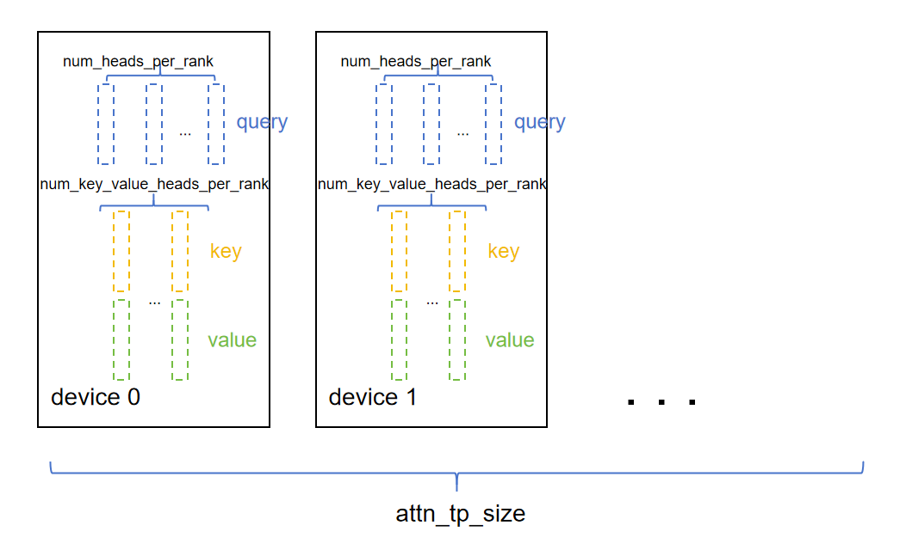

# 基于Atlas A2的GPT-OSS模型推理性能优化实践
## 概述
本文主要介绍GPT-OSS系列模型基于NPU的推理的优化方式。基于Atlas A2 系列产品，GPT-OSS-120B模型可以采用8卡部署，GPT-OSS-20B模型可以在单device上进行部署。

## 性能优化
### Attention Tensor Parallel (TP)优化
对Attention的张量切分策略可以分为对QKV头的切分和对线性层的切分。
在对QKV头切分时，attention的多头计算机制可以方便进行张量切分，每个头先独立计算，再将结果concat起来。假设模型的attention层需要对`num_heads`个query按照切分数量`tp_size`进行切分，要求`num_heads`必须能被`tp_size`整除，每张卡放置query头个数为`num_heads_per_rank = num_heads // tp_size`；key和value头数相等，且可能小于等于query头个数（在MQA和GQA的场景下会小于）。为了确保每张卡至少放置一个key和value头，每张卡放置的key或value头数计算方法为
`num_key_value_heads_per_rank = max(num_key_value_heads // tp_size, 1)`。QKV头在卡上排布情况如下图所示。



针对`q_proj`、`k_proj`和`v_proj`三个线性层，可以进一步合并为一个线性层`qkv_proj`，即在推理中将三个矩阵乘替换为一个矩阵乘，可以最大化使用NPU的计算能力提升性能。随后将结果切分得到Q、K、V，并进行attention计算，最后通过`o_proj`层输出。

### MoE Tensor Parallel优化
假设模型的MoE层的切分数量为`tp_size`，专家个数为expert_num。对MoE层进行张量切分时，对`gate_proj`与`up_proj`进行列切分，对`down_proj`进行行切分。对`gate_proj`和`up_proj`可以采取合并matmul的优化方式，得到`gate_up_proj`，实现计算性能优化。

### 固定KV Cache大小
- 首先申请一块固定大小的KV Cache tensor，以优化源码动态申请内存的性能损失。KV Cache的大小为`(batch * seq_len * num_key_value_heads_per_rank * head_dim)`，其中`seq_len`至少为输入和输出的最大总和，以保证在推理过程中KV Cache的更新不会越界。具体实现体现在`GptOssForCausalLM`类的`init_cache`函数中。
- 在计算完Q、K、V后，可以通过`scatter_update`算子对指定位置上的KV Cache进行更新，可参考[torch_npu.scatter_update](https://www.hiascend.com/document/detail/zh/Pytorch/710/apiref/torchnpuCustomsapi/context/torch_npu-scatter_update.md)接口。

### 使能融合算子
#### RMSNorm融合与AddRMSNorm融合
替换`GptOssRMSNorm`的`forward`函数，使用融合算子接口[torch_npu.npu_rms_norm](https://www.hiascend.com/document/detail/zh/Pytorch/710/apiref/torchnpuCustomsapi/context/%EF%BC%88beta%EF%BC%89torch_npu-npu_rms_norm.md)和`torch_npu.npu_add_rms_norm`，将多个算子的计算替换成融合kernel，提升性能。

#### GMM使能与Routing优化
在GPT-OSS的MoE专家模块中，通过使能融合算子，进一步提升性能，可以参考`GptOssMLP`类中的实现。

### Flash Attention融合算子优化
通过使能[torch_npu.npu_fused_infer_attention_score_v2](https://www.hiascend.com/document/detail/zh/Pytorch/720/apiref/torchnpuCustomsapi/context/torch_npu-npu_fused_infer_attention_score_v2.md)推理场景下支持图模式的FlashAttention算子，既可以支持全量计算场景,也可支持增量计算场景。

- 快速选择专家：在计算专家和token之间的路由分数时，可以使用[torch_npu.npu_moe_gating_top_k_softmax](https://www.hiascend.com/document/detail/zh/Pytorch/710/apiref/torchnpuCustomsapi/context/torch_npu-npu_moe_gating_top_k_softmax.md)融合算子，代替原来先topk再softmax的多算子操作，可以更快速地计算出token和专家的分数。
- 高效排序和token路由：
    - 使能[torch_npu.npu_moe_init_routing](https://www.hiascend.com/document/detail/zh/Pytorch/710/apiref/torchnpuCustomsapi/context/torch_npu-npu_moe_init_routing.md)融合算子，实现MoE routing计算，获取专家的排序；
    - 使能[torch_npu.npu_moe_compute_expert_tokens](https://www.hiascend.com/document/detail/zh/Pytorch/710/apiref/torchnpuCustomsapi/context/torch_npu-npu_moe_compute_expert_tokens.md)融合算子，获取每个专家需要计算的token数；
    - 使能[torch_npu.npu_moe_finalize_routing](https://www.hiascend.com/document/detail/zh/Pytorch/710/apiref/torchnpuCustomsapi/context/torch_npu-npu_moe_finalize_routing.md)融合算子，将专家计算完成后的token重新排布并加权求和，获得最终输出。
- 高性能专家计算：使能[torch_npu.npu_grouped_matmul](https://www.hiascend.com/document/detail/zh/Pytorch/710/apiref/torchnpuCustomsapi/context/torch_npu-npu_grouped_matmul.md)融合算子，实现多个专家的矩阵乘计算，提高计算和搬运效率。

### 集合通信使能AIV展开
利用Device的Vector Core计算单元来加速AllReduce操作，可通过环境变量[HCCL_OP_EXPANSION_MODE](https://www.hiascend.com/document/detail/zh/CANNCommunityEdition/83RC1alpha002/maintenref/envvar/envref_07_0096.html)使能AIV，配置如下：

```shell
export HCCL_OP_EXPANSION_MODE=AIV
```

## 附录
[环境部署以及样例执行](../../../models/gpt-oss/README.md)