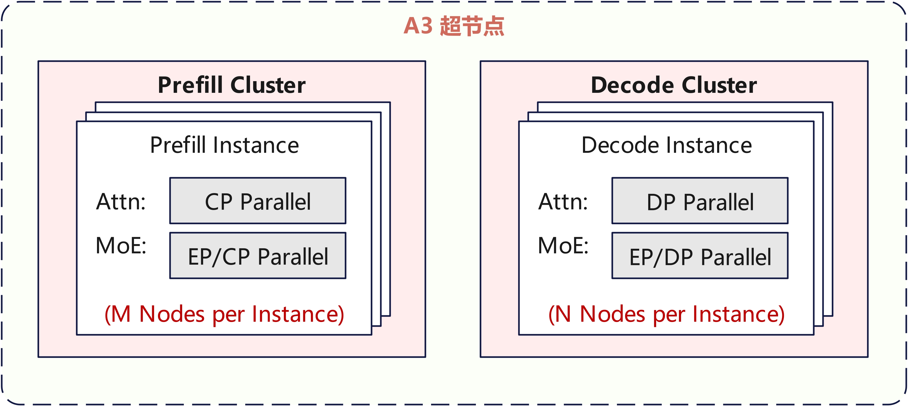
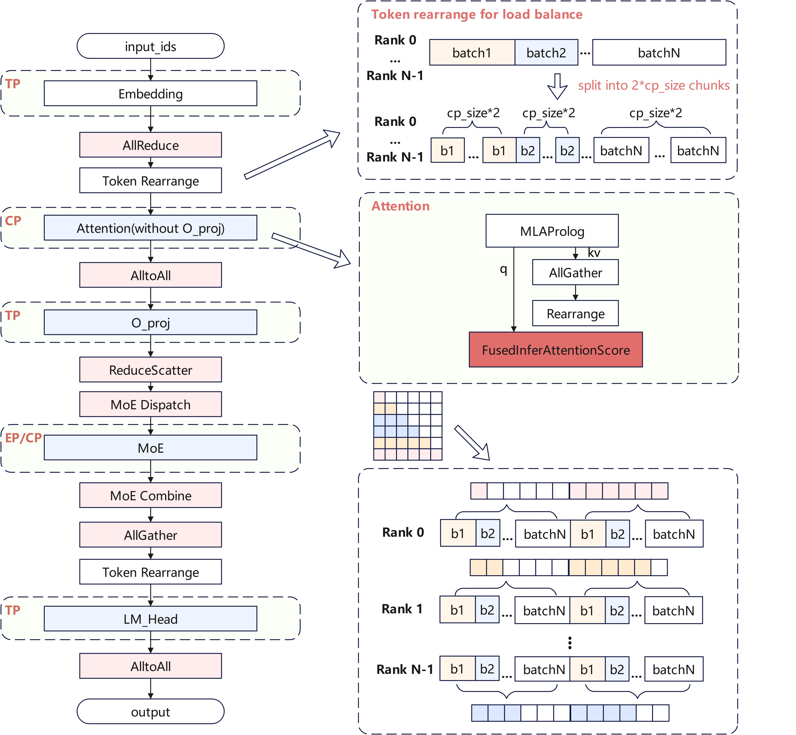
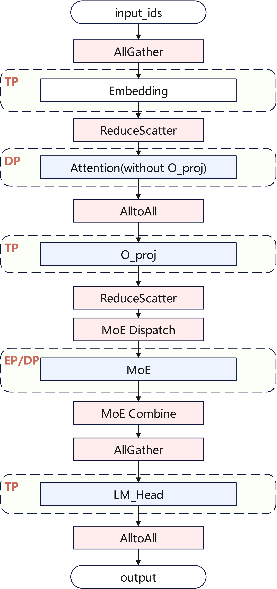
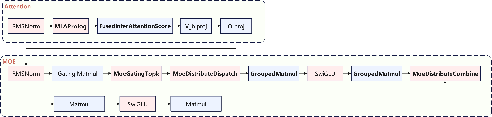

# NPU Kimi-K2-Thinking推理优化实践

11月6日，Moonshot AI发布了最新的Kimi-K2-Thinking思考模型，擅长深度推理，打榜性能再创新高。其模型结构和Kimi-K2保持一致，原生支持MOE W4A16 + Attention BF16混合精度模式，兼顾推理性能与效果。

本文主要介绍基于A3集群的Kimi-K2-Thinking模型的推理优化，由于其结构与Kimi-K2基本一致，[基础优化点](../deepseek-r1/deepseek_r1_decode_optimization.md)可平滑继承。针对该模型涉及到的MOE W4A16量化，本实践已0day适配支持，并提供了A3集群的推荐部署策略，未来将持续进行性能优化。

## Highlights
- CANN已0day支持Kimi-K2-Thinking 256K序列推理部署，[模型推理代码](../../../models/kimi-k2-thinking/README.md)已开源，同时也适配了主流开源推理框架[SGLang](https://github.com/sgl-project/sglang/pull/12759)
- 本实践支持Kimi-K2-Thinking原生量化模式，MOE GroupedMatmul采用W4A16计算，Attention保留BF16精度模式，兼顾推理性能与效果，配套的GroupedMatmul[算子实现](https://gitcode.com/cann/ops-transformer/tree/master/gmm/grouped_matmul)已全面开源
- 针对小batch size、长序列生产等典型推理场景，Decode MLA已实现Flash Decode加速机制，有效降低时延并提升算力利用率，配套的FusedInferAttentionScore[算子实现](https://gitcode.com/cann/ops-transformer/tree/master/attention/fused_infer_attention_score)已全面开源
- 本实践的最小部署单元为单机，可支持4K序列长度的推理任务；同时支持多机大EP部署模式，通过多机集群协同部署，可满足256K超长序列的推理需求

## Outline

- [并行策略](##并行策略)
- [融合Kernel](##融合Kernel)
- [MTP](##MTP)
- [Future Plan](##Future-Plan)

## 并行策略
Atlas A3推荐部署策略如下图所示，Prefill使用M个节点部署，Decode使用N个节点部署，每个节点包含8卡，推荐根据资源数量、SLA等约束，M和N在1~24内动态调整。

  

### Prefill并行策略

考虑到长序列场景，Prefill Attention选用Context Parallel(CP)并行，多个rank均摊长序列的计算，单rank的计算量和activation内存都较小，TTFT较为可控，用户体验更好。MoE模块则沿用DeepSeek-V3.1的EP并行，兼顾吞吐与时延。

  

### Decode并行策略

Decode阶段依旧沿用DeepSeek V3.1的部署策略，选用Attention DP + MoE EP部署。

特别地，由于O_proj和LM_Head权重内存较大，且在Decode阶段表现为明显的访存瓶颈，本实践选用局部TP并行。同时为了降低设备内存占用，Embedding层同样使用TP切分。为了尽可能地减小TP并行带来的通信开销，TP域控制在单机内。

  

## 融合Kernel
整网计算流如下图所示，本实践使用了MLAProlog、FusedInferAttentionScore、MoeDistributeDispatch、MoeDistributeCombine、GroupedMatmul等融合Kernel，可供其他同类模型在昇腾平台的高效落地提供实践参考。

  

## MTP

相较于DeepSeek V3.1，Kimi-K2-Thinking的Attention Head数量从128精简至64，使得Attention计算量显著降低，更利好MTP场景。LLM推理Decode阶段通常为访存瓶颈，MTP可通过少量计算代价来缓解访存压力，而 Kimi-K2-Thinking的Attention本身计算负载更轻，因此在 MTP模式下更难触及计算瓶颈，性能更优。

本实践对应的代码已支持多头 MTP 功能，若具备训练完成的MTP权重，可直接启用该功能以实现推理加速。

## Future Plan

- 量化：目前支持MOE W4A16推理，未来可针对Attention开发低比特量化版本，进一步降低系统内存占用与时延
- 长序列性能优化：长序列场景下的TTFT仍有优化空间，后续将探索更亲和的部署方案，并针对性优化融合 Kernel 性能，全面提升长序列推理的响应速度与运行效率
