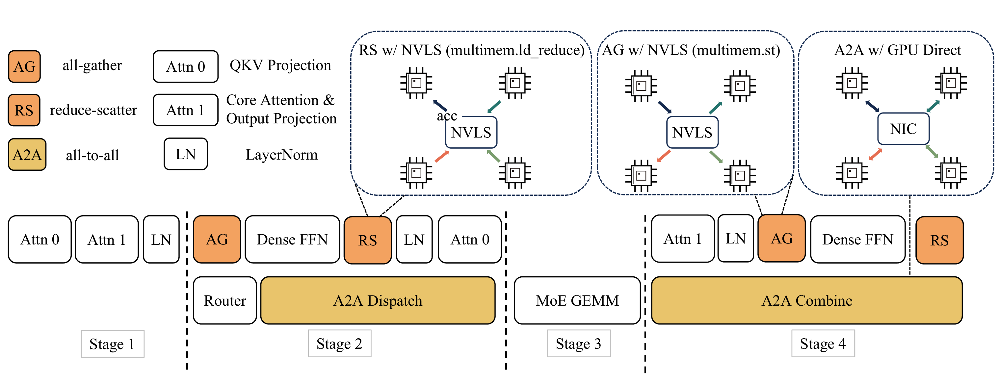
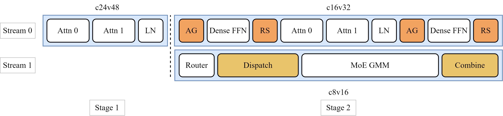
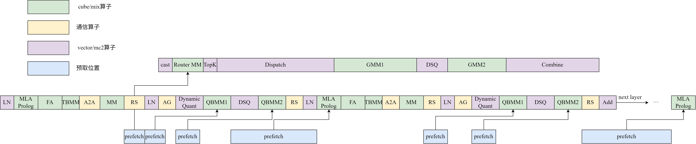
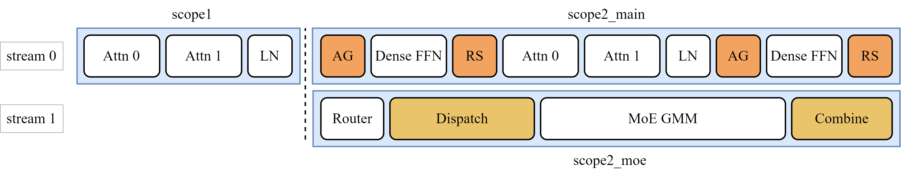
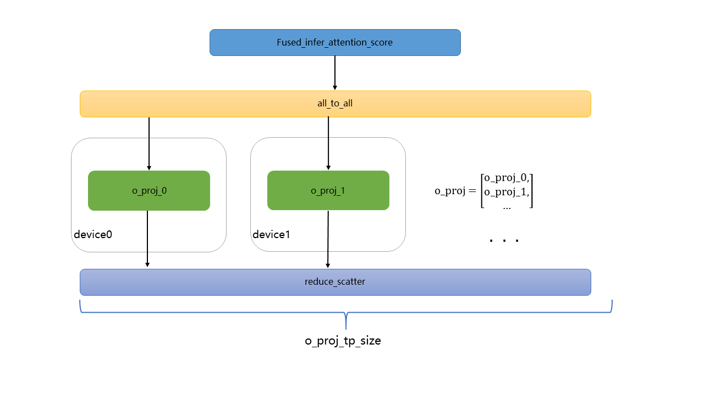
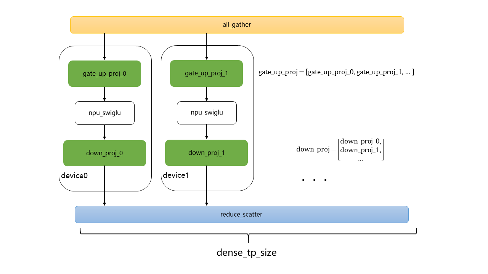

# 基于Atlas A3集群的LongCat-Flash模型推理性能优化实践
## 概述
本文主要介绍基于Atlas A3系列产品的LongCat-Flash模型的优化方式。

## 性能优化

### 通用优化
LongCat-Flash结构中的与Llama类似的部分，可参考通用优化点[Llama](https://gitcode.com/Ascend/torchair/tree/master/npu_tuned_model/llm/llama)的改动，如固定KV Cache大小、cos/sin优化、AddRMSNorm融合等。

### 使能图模式
使用静态图可以获得更好的推理性能。`LongcatFlashRunner`通过覆写`executor/model_runner.py`中的`ModelRunner`的`graph_compile`函数，将模型编译为静态图，当前暂不支持acl_graph。

#### 使能图编译缓存
torch.compile是一种即时编译器（Just-In-Time compiler），成图首次编译时间通常较长，在时延敏感的模型推理场景下，使能图编译缓存可以缓存编译后的静态图，有效缩短服务启动后的首次推理时延，从而提高推理性能。可参考`LongcatFlashRunner`中`graph_compile`函数中的使用：

```python
if self.enable_cache_compile:
    case_name = "compile_cache/" + os.getenv("CASE_NAME")
    cache_model = self.model.decode
    if self.is_mtp:
        case_name += "_spec"
        cache_model = self.model.mtp_compile_decode
    cache_dir = os.path.join(os.path.dirname(os.path.abspath(__file__)), case_name)
    self.model.decode = tng.inference.cache_compile(cache_model, cache_dir=cache_dir,
                        config=compiler_config, dynamic=False, fullgraph=True, ge_cache=True)
```
主模型缓存默认路径为`./compile_cache/CASE_NAME`，mtp模型缓存默认路径为`./compile_cache/CASE_NAME_spec`。

### 多流并行与控核
大模型推理场景下，对于一些可并行的场景，可以划分多个stream做并行计算，多个stream上的计算形成overlap，从而降低整体计算耗时。多流并行技术的详细介绍，请参考[官方文档](https://www.hiascend.com/document/detail/zh/Pytorch/720/modthirdparty/torchairuseguide/torchair_00026.html)

多流场景下，会出现所有核（Core）都被一个流占用的情况，导致算子执行并行度降低，因此需要把核分给不同的流用，从而保证算子并行执行的收益。控核技术的详细介绍，请参考[官方文档](https://www.hiascend.com/document/detail/zh/Pytorch/720/modthirdparty/torchairuseguide/torchair_00044.html)

原始的[LongCat-Flash模型](https://arxiv.org/pdf/2509.01322)在论文中提供了四阶段的并行策略，其方案图如下所示。



我们对并行策略进行了调整，调整后的多流并行和控核方案图如下所示。将第二段attention和FFN专家提前执行，并通过控制多流上的ai core和vector core核数，使得双流的计算时间接近，无明显拖尾，提升性能。其中stage1不做控核，默认占用全部的ai core和vector core核数，stage2里的stream0采用c16v32控核方案，stream1采用c8v16。



实现多流并行和控核可以参考以下伪代码。
```python
attn
layernorm
with npu_stream_switch(True, "1"):
    with limit_core_num(True, "8", "16"):
        router
        dispatch
        gmm
        combine
with limit_core_num(True, "16", "32"):
    dense
    attn
    layernorm
    dense
```


### 权重预取
该优化提供网络weight预取功能，在算子计算的同时，利用空闲的带宽，提前将一些访存bound算子的权重搬运到L2 Cache中，提升算子性能。npu_prefetch技术的详细介绍，请参考[官方文档](https://www.hiascend.com/document/detail/zh/Pytorch/720/apiref/torchnpuCustomsapi/context/torch_npu-npu_prefetch.md)。npu_prefetch优化功能可通过`enable_prefetch`开关使能。下图为LongCat-Flash模型的预取位置。我们针对访存bound的算子如QuantBatchMatmul (QBMM)、MLA_Prolog、matmul等算子提前预取了对应的权重。其中MLA_Prolog算子包含了多个matmul，搬运bound较大，因此我们提前预取了前置的QBMM的权重，为MLA_Prolog提供了更大的预取空间，获取较大的性能收益。具体的预取大小及预取位置，可在`models/modeling_longcat_flash.py`中搜索`npu_prefetch`接口查看。




### 使能SuperKernel
SuperKernel优化功能在decode启用`ge_graph`图模式的场景下，根据用户定义的范围对模型的计算图进行优化。SuperKernel技术的详细介绍，请参考[官方文档](https://www.hiascend.com/document/detail/zh/Pytorch/710/modthirdparty/torchairuseguide/torchair_00035.html)。SuperKernel优化功能将通过`enable_superkernel`开关使能，可将部分算子优化在一个SuperKernel scope内，从而实现对任务调度的等待时间和调度开销的优化，提升整体性能。由于我们在不同流上采取了不同的分核策略，按照分核、分流的范围标定各SuperKernel scope的范围即可。下图为针对Longcat-Flash模型标定的SuperKernel范围。




### MLA (Multi-Head Latent Attention)低秩压缩优化
Decode阶段参考[Deepseek论文](https://arxiv.org/pdf/2405.04434)中提及的低秩压缩方法，可以减少KV cache占用的内存，提升推理效率，相关实现可以参考`LongcatFlashAttention`类中的 `forward_page_attention_absorb`函数。MLA整体采用Data Parallelism (DP) 数据并行，并针对o_proj matmul单独采用Tensor Parallelism (TP)切分提升性能。

#### 融合算子优化
- MLA前置计算性能优化：使能[npu_mla_prolog_v3]融合kernel，替换attention计算前的计算，其中包含Q、K、V的线性层计算、旋转位置编码 (ROPE)、RmsNorm计算及KV Cache更新等计算处理；
- Attention性能优化：使能[npu_fused_infer_attention_score](https://www.hiascend.com/document/detail/zh/Pytorch/720/apiref/torchnpuCustomsapi/context/torch_npu-npu_fused_infer_attention_score.md)融合kernel，实现对MLA计算的加速。

#### o_proj Tensor Parallelism K轴切分
对线性层o_proj进行行切分处理，o_proj的输入维度为`num_heads * v_head_dim`，输出维度为`hidden_size`。在进行o_proj TP时，将这一输入维度按照`o_proj_tp_size`进行切分，要求`num_heads * v_head_dim`能被`o_proj_tp_size`整除，每个rank上只保存一部分输入通道对应的权重。在推理过程中，`attn_output`先经过`all_to_all`，使得每个rank只拿到自己负责的那一段输入特征，然后每个rank对局部张量执行线性层变换，得到局部输出，最后通过`reduce_scatter`对各rank的局部输出按元素求和，并在batch维度切分，得到各rank的输出。



### MoE (Mixture of Experts)模块实现Expert Parallel (EP)及使能融合算子
MoE计算阶段采用EP (Expert Parallelism)切分策略，将路由专家和零计算专家均匀分布到每张卡上。

#### Router使能融合算子
使用[torch_npu.npu_moe_gating_top_k](https://www.hiascend.com/document/detail/zh/Pytorch/720/apiref/torchnpuCustomsapi/context/torch_npu-npu_moe_gating_top_k.md)算子，对router计算的结果排序，并选取前top-k个专家。

#### Prefill阶段优化
Prefill阶段路由专家采用**Double-Routing**的计算策略完成计算,具体计算步骤可参见[基于Atlas A3集群的DeepSeek-R1模型prefill阶段推理性能优化实践](../deepseek-r1/deepseek_r1_prefill_optimization.md)的MoE部署策略优化章节。

#### Decode阶段优化
- 高性能专家计算：使用[torch_npu.npu_grouped_matmul](https://www.hiascend.com/document/detail/zh/Pytorch/720/apiref/torchnpuCustomsapi/context/torch_npu-npu_grouped_matmul.md)算子，可以同时处理多个专家的计算，提高计算和搬运效率；
- 多卡间高性能通信路由：使能[torch_npu.npu_moe_distribute_dispatch_v2](https://www.hiascend.com/document/detail/zh/Pytorch/720/apiref/torchnpuCustomsapi/context/torch_npu-npu_moe_distribute_dispatch_v2.md) 和[torch_npu.npu_moe_distribute_combine_v2](https://www.hiascend.com/document/detail/zh/Pytorch/720/apiref/torchnpuCustomsapi/context/torch_npu-npu_moe_distribute_combine_v2.md)算子，实现EP并行下多卡间的通信。通过传入参数`copy_expert_num`使能dispatch_v2和combine_v2算子支持零专家处理，计算公式为：`MoE(ori_x) = ori_x`。在使用前可参考上述的算子文档，检查`HCCL_BUFFSIZE`等环境变量的配置是否合理，了解该算子的使用场景和约束。

### MLP线性层优化
#### MLP线性层计算合并
原始`LongCatFlashMLP`实现中，存在`gate_proj`、`up_proj`与`down_proj`三个matmul运算，可通过将`gate_proj`与`up_proj`进行合并计算，得到`gate_up_proj`提升整体计算效率。

#### MLP线性层TP切分
在MLP的计算中，`gate_up_proj`和`down_proj`需要全量存储到每一个device上，造成device内存压力，本优化将`gate_up_proj`沿N轴切分、`down_proj`沿K轴切分到`dense_tp`域内的不同device上，以完成MLP线性层的TP切分，降低单个device的内存使用，并减少matmul矩阵运算时的权重搬运开销。需要注意的是，MLP阶段采用TP切分，但前后的Attention模块采用的是DP切分，在MLP计算之前和之后需要分别进行AllGather和ReduceScatter，完成DP -> TP -> DP的并行方式转化。虽然有额外的通信开销，但整体仍有较好的性能收益。在当前的优化实践中，Dense FFN专家采用TP8切分。



### 支持Multi-Token Prediction (MTP)
实现了MTP投机推理，在未达到计算bound的场景下，MTP计算可以实现较好的推理加速效果。可通过`next_n`参数使能MTP。当前支持了MTP1，MTP2。

## Benchmark

基于Atlas A3，本实践对Longcat-Flash W8A8量化版本进行了性能Benchmark测试。
|Quant Mode| Global Batch Size | Seq Length | Chips | TPOT (ms) | Throughput (tokens/p/s) |
|-------| ----------------- | ---------- | ----- | --------- | ----------------------- |
|W8A8 |    512           | 4608       | 128   | 10.37      |   771.46                 |

> 1. 性能数据基于 MTP2 与 perfect eplb 配置采集。
> 2. 当前CANN软件版本（CANN 8.5.0.alpha002）下，SuperKernel标记范围内的部分算子尚不支持完全融合。该限制将在后续社区版本中得到解决，以进一步提升模型性能。
---
## 附录
[环境部署以及样例执行](../../../models/longcat-flash/README.md)