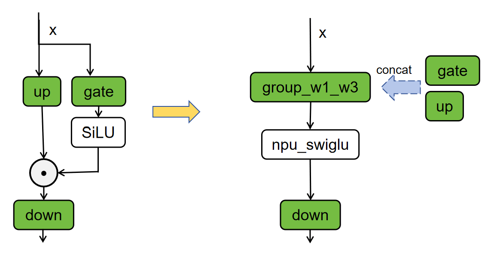

# 基于Atlas A3训练/推理集群的Qwen3-MoE模型低时延推理性能优化实践
## 概述
本文主要介绍Qwen3-MoE模型基于NPU的低时延推理优化策略。基于Atlas A3 训练/推理系列产品，decode采用8卡部署，实现BF16场景下单batch推理时延小于20ms。

## 低时延场景Tensor Parallel (TP)优化
### Attention TP优化
#### 切分策略
对Attention的张量切分策略可以分为对QKV头的切分和对线性层的切分。
在对QKV头切分时，attention的多头计算机制可以方便进行张量切分，每个头先独立计算，再将结果concat起来。假设模型的attention层需要对`num_heads`个query按照切分数量`attn_tp_size`进行切分，要求`num_heads`必须能被`attn_tp_size`整除，每张卡放置query头个数为`num_heads_per_rank = num_heads // attn_tp_size`；key和value头数相等，且可能小于等于query头个数（在MQA和GQA的场景下会小于）。为了确保每张卡至少放置一个key和value头，每张卡放置的key或value头数计算方法为
`num_key_value_heads_per_rank = max(num_key_value_heads // attn_tp_size, 1)`。QKV头在多卡上的排布情况如下图所示。


在对线性层`o_proj`进行切分时，按照行切分即可。

#### 计算分解
该优化策略先将Q、K、V的线性层计算合并为一次Matmul计算（图中merged_qkv_proj），提升计算性能。将`merged_qkv_proj`的输出结果按Q、K、V拆分后，对Q和V进行归一化操作并使用旋转位置编码，再计算attention（图中Fused_infer_attention_score），最后通过o_proj层输出。


### MoE TP优化
#### 切分策略
假设模型的MoE层的切分数量为`moe_tp_size`，专家个数为expert_num。对MoE层进行张量切分，每个专家相当于一个mlp层，切分方法与mlp的张量切分方法相似。具体做法是对`gate_proj`与`up_proj`进行列切分，对`down_proj`进行行切分。同时对`gate_proj`与`up_proj`线性层采用合并计算的优化方式，得到`w13_weight`。

#### 计算分解
每个专家层存在gate_proj、up_proj与down_proj三个matmul运算，具体运算为 x = down( SiLU(gate(x))*up(x) )。本优化将张量切分后的gate_proj和up_proj进行concat操作，再使能[torch_npu.npu_swiglu](https://www.hiascend.com/document/detail/zh/Pytorch/710/apiref/torchnpuCustomsapi/context/%EF%BC%88beta%EF%BC%89torch_npu-npu_swiglu.md)融合算子接口优化，该算子能完成以下两步计算：
- 将输入的x沿最后一维切分为两块，即x = torch.chunk(x, 2, -1)。
- 计算并返回 SiLU(x[0]) * x[1]。

本优化通过将gate_proj与up_proj合并计算，提升整体计算效率。



## 使能融合算子
### GMM使能&&Routing优化
在MoE模块中，如果通过for循环处理每个专家，单独计算`expert_num`个前馈神经网络（FFN），容易导致计算效率较低。CANN提供了`GroupedMatmul`算子，可以同时计算多个专家，从而提高计算和搬运效率。具体实现可参考在`Qwen3MoeSparseMoeBlock`类中的`moe_infer_tp`和`moe_infer_fusion`函数。

- 快速选择专家：在计算专家和token之间的路由分数时，可以使用[torch_npu.npu_moe_gating_top_k_softmax](https://www.hiascend.com/document/detail/zh/Pytorch/710/apiref/torchnpuCustomsapi/context/torch_npu-npu_moe_gating_top_k_softmax.md)融合算子，代替原来先topk再softmax多算子操作，可以更快速地计算出token和专家的分数。
- 高效排序和token路由：
    - 使能[torch_npu.npu_moe_init_routing](https://www.hiascend.com/document/detail/zh/Pytorch/710/apiref/torchnpuCustomsapi/context/torch_npu-npu_moe_init_routing.md)融合算子，实现MoE routing计算，获取专家的排序；
    - 使能[torch_npu.npu_moe_compute_expert_tokens](https://www.hiascend.com/document/detail/zh/Pytorch/710/apiref/torchnpuCustomsapi/context/torch_npu-npu_moe_compute_expert_tokens.md)融合算子，获取每个专家需要计算的token数；
    - 使能[torch_npu.npu_moe_finalize_routing](https://www.hiascend.com/document/detail/zh/Pytorch/710/apiref/torchnpuCustomsapi/context/torch_npu-npu_moe_finalize_routing.md)融合算子，将专家计算完成后的token重新排布并加权求和，获得最终输出。
- 高性能专家计算：使能[torch_npu.npu_grouped_matmul](https://www.hiascend.com/document/detail/zh/Pytorch/710/apiref/torchnpuCustomsapi/context/torch_npu-npu_grouped_matmul.md)融合算子，实现多个专家的矩阵乘计算，提高计算和搬运效率。

### RmsNorm算子优化
通过使能[torch_npu.npu_rms_norm](https://www.hiascend.com/document/detail/zh/Pytorch/60RC2/apiref/apilist/ptaoplist_000140.html)算子，能够提升模型的推理性能。RmsNorm是大模型常用的归一化操作，相比LayerNorm，其去掉了减去均值的部分。

### flash attention融合算子优化
通过使能[torch.ops.npu.npu_fused_infer_attention_score](https://www.hiascend.com/document/detail/zh/Pytorch/710/modthirdparty/torchairuseguide/torchair_00086.html)推理场景下支持图模式的FlashAttention算子，既可以支持全量计算场景，也可支持增量计算场景。

## 使能图模式
使用静态图可以获得更好的推理性能。`Qwen3MoeRunner`通过覆写`executor/model_runner.py`中的`ModelRunner`的`graph_compile`函数，将模型编译为静态图。

## 使能图编译缓存
在模型推理场景下，使能图编译缓存可以缓存编译后的静态图，避免每次推理都需要编译模型，从而提高推理性能。可参考`Qwen3MoeRunner`中`graph_compile`函数中的使用：

```python
if self.enable_cache_compile:
            case_name = "compile_cache/" + os.getenv("CASE_NAME")
            cache_dir = os.path.join(os.path.dirname(os.path.abspath(__file__)), case_name)
            self.model.decode = tng.inference.cache_compile(self.model.decode, cache_dir=cache_dir, 
                                config=compiler_config, dynamic=True, fullgraph=True, ge_cache=True)
```
缓存默认路径为`./compile_cache/CASE_NAME`。

## 集合通信使能AIV展开
利用Device的Vector Core计算单元来加速通信操作的执行，可参考[HCCL_OP_EXPANSION_MODE环境变量](https://www.hiascend.com/document/detail/zh/CANNCommunityEdition/83RC1alpha002/maintenref/envvar/envref_07_0096.html)：

```shell
export HCCL_OP_EXPANSION_MODE=AIV
```
## 附录
[环境部署以及样例执行](../../../models/qwen3_moe/README.md)